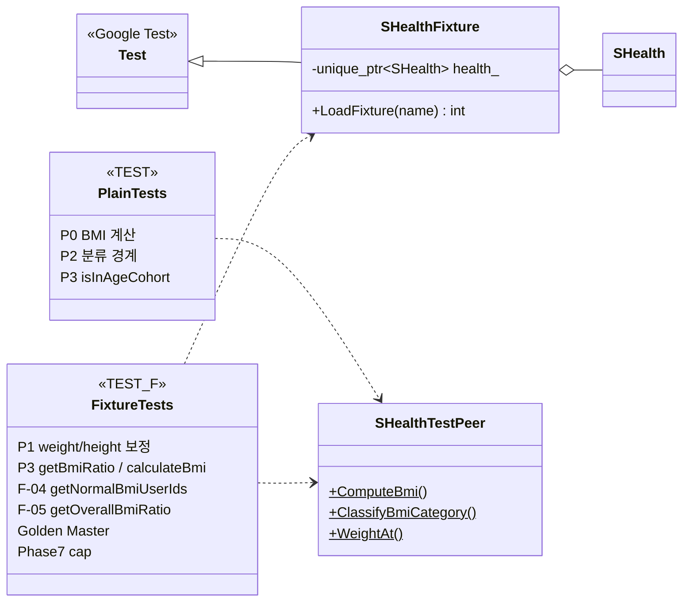

# SHealth BMI — 소프트웨어 아키텍처

| 항목 | 내용 |
|------|------|
| 문서 목적 | 2차 리팩토링·TDD·기능 개선(F-01~F-05) **이후** 최종 코드 구조를 클래스 다이어그램으로 기록 |
| 기준 코드 | `src/main/cpp/`, `src/test/cpp/SHealthBMITest.cpp` |
| 관련 문서 | `docs/refactoring_plan.md`, `docs/test_plan.md` |
| 검증 기준 | `ctest` **50/50 Green** (Golden Master 포함) |

---

## 1. 구조 개요

`SHealth`는 **파사드(Facade)** 역할만 수행한다. CSV 로드·누락 보정·BMI 분류·연령대/전체 통계는 각각 `shealth::detail` 및 `shealth::domain` 네임스페이스로 분리되어 있으며, 파사드는 `calculateBmi` 파이프라인에서 이들을 순서대로 호출한다.

```text
SHealthBMI (main)
    └── SHealth::calculateBmi
            ├── csv::loadFromCsv        → vector<PersonRecord>
            ├── impute::fill*Zeros      → 보정
            ├── domain::computeBmi      → 레코드별 BMI
            ├── stats::compute*Ratios   → cohortRatios_ / overallRatios_
            └── (조회) getBmiRatio / getOverallBmiRatio / getNormalBmiUserIds
```

| 레이어 | 구성 | 책임 |
|--------|------|------|
| **진입점** | `SHealthBMI.cpp` | `shealth.dat` 로드 후 `shealth::report::formatCohortBmiRatioReport`로 stdout 출력 |
| **파사드** | `SHealth` | Public API·상태(`records_`, 비율 캐시)·오케스트레이션 |
| **I/O** | `shealth::detail::csv` | CSV 분할·`istream` 로드(DIP)·`kMaxCsvRecords` 상한 |
| **보정** | `shealth::detail::impute` | 연령대별 `weight`/`height` 0 → 동일 연령대 평균 |
| **통계** | `shealth::detail::stats` | 연령대 6×BMI 4 비율·전체 비율 |
| **도메인** | `shealth::domain` | BMI 계산·4단계 분류·연령 구간·`constexpr` 테이블 |
| **모델** | `PersonRecord` | id/age/weight/height/bmi 단일 레코드 |
| **리포트** | `shealth::report` | Golden Master용 리포트 문자열 생성 |
| **테스트** | Google Test + `SHealthFixture` / `SHealthTestPeer` | 단위·통합·Golden 회귀 |

---

## 2. 클래스 다이어그램

```mermaid
classDiagram
    direction TB

    %% --- 모델 ---
    class PersonRecord {
        +int id
        +int age
        +double weight
        +double height
        +double bmi
    }

    %% --- 도메인 (헤더 only, 순수 함수) ---
    class BmiCategoryType {
        <<enumeration>>
        Underweight = 100
        Normal = 200
        Overweight = 300
        Obesity = 400
    }

    class BmiCategoryIndex {
        <<enumeration>>
        Underweight = 0
        Normal = 1
        Overweight = 2
        Obesity = 3
    }

    class AgeCohortDescriptor {
        +int ageClass
        +int cohortIndex
        +int minAge
        +int maxAgeExclusive
    }

    class BmiCategoryDescriptor {
        +BmiCategoryType apiType
        +BmiCategoryIndex storageIndex
        +const char* label
    }

    class shealth_domain {
        <<namespace>>
        +kAgeCohorts[] AgeCohortDescriptor
        +kBmiCategories[] BmiCategoryDescriptor
        +isInAgeCohort(age, ageClass) bool
        +ageClassToCohortIndex(ageClass) int
        +typeToCategoryIndex(type) int
        +classifyBmiCategory(bmi) int
        +computeBmi(weightKg, heightCm) double
    }

    %% --- detail 컴포넌트 ---
    class shealth_detail_csv {
        <<namespace>>
        +kMaxCsvRecords = 10000
        +split(line, delimiter) vector~string~
        +loadFromCsv(istream, records, maxRecords) bool
        +loadFromCsv(filename, records, maxRecords) bool
    }

    class shealth_detail_impute {
        <<namespace>>
        +fillWeightZeros(records) void
        +fillHeightZeros(records) void
    }

    class shealth_detail_stats {
        <<namespace>>
        +computeAgeCohortRatios(records, cohortRatios) void
        +computeOverallRatios(records, overallRatios) void
    }

    class shealth_report {
        <<namespace>>
        +formatCohortBmiRatioReport(health) string
    }

    %% --- 파사드 ---
    class SHealth {
        -vector~PersonRecord~ records_
        -cohortRatios_ array~6x4~
        -overallRatios_ array~4~
        +calculateBmi(filename) int
        +getBmiRatio(ageClass, type) double
        +getBmiRatio(ageClass, BmiCategoryType) double
        +getOverallBmiRatio(type) double
        +getOverallBmiRatio(BmiCategoryType) double
        +getNormalBmiUserIds() vector~int~
        -loadFromCsv(filename) bool
        -imputeMissingWeights() void
        -imputeMissingHeights() void
        -computeAllBmi() void
        -computeAgeCohortRatios() void
        -computeOverallRatios() void
        -classifyBmiCategory(bmi)$ int
        -computeBmi(w, h)$ double
        -isInAgeCohort(age, ageClass)$ bool
    }

  class SHealthBMI {
        <<executable>>
        +main() int
    }

    %% --- Google Test ---
    class testing_Test {
        <<Google Test>>
        #SetUp()*
        #TearDown()*
    }

    class SHealthFixture {
        #unique_ptr~SHealth~ health_
        #LoadFixture(fileName) int
    }

    class SHealthTestPeer {
        <<test only>>
        +ComputeBmi(w, h)$ double
        +ClassifyBmiCategory(bmi)$ int
        +IsInAgeCohort(age, ageClass)$ bool
        +WeightAt(health, index)$ double
        +HeightAt(health, index)$ double
        +BmiAt(health, index)$ double
        +IdAt(health, index)$ int
    }

    class SHealthBMITest {
        <<test suite>>
        TEST ComputeBmi_*
        TEST ClassifyBmi_*
        TEST IsInAgeCohort_*
    }

    class SHealthFixtureTests {
        <<test suite>>
        TEST_F ImputeWeight_*
        TEST_F GetBmiRatio_*
        TEST_F GoldenMaster_*
        TEST_F GetNormalBmiUserIds_*
        TEST_F GetOverallBmiRatio_*
    }

    %% --- 관계 ---
    SHealth *-- PersonRecord : records_
    SHealth ..> shealth_detail_csv : load / split
    SHealth ..> shealth_detail_impute : impute
    SHealth ..> shealth_detail_stats : ratios
    SHealth ..> shealth_domain : classify / compute / map
    shealth_domain *-- AgeCohortDescriptor
    shealth_domain *-- BmiCategoryDescriptor
    shealth_domain --> BmiCategoryType
    shealth_domain --> BmiCategoryIndex
    shealth_detail_impute ..> PersonRecord
    shealth_detail_impute ..> shealth_domain : kAgeCohorts
    shealth_detail_stats ..> PersonRecord
    shealth_detail_stats ..> shealth_domain : classify
    shealth_detail_csv ..> PersonRecord
    shealth_report ..> SHealth : getBmiRatio
    shealth_report ..> shealth_domain : kAgeCohorts / kBmiCategories
    SHealthBMI --> SHealth
    SHealthBMI --> shealth_report

    SHealth +-- SHealthTestPeer : friend
    SHealthTestPeer ..> SHealth : private access
    SHealthFixture --|> testing_Test
    SHealthFixture o-- SHealth : health_
    SHealthFixtureTests ..> SHealthFixture : TEST_F
    SHealthBMITest ..> SHealthTestPeer : TEST (no fixture)
    SHealthFixtureTests ..> SHealthTestPeer : static helpers
```

> **표기:** `shealth_domain`, `shealth_detail_csv` 등은 Mermaid에서 네임스페이스를 묶기 위한 가상 클래스이다. 실제 코드는 `shealth::domain`, `shealth::detail::csv` 등 **자유 함수 + `constexpr` 테이블**로 구현되어 있으며, 별도 인스턴스화 클래스는 없다.

---

## 3. `SHealth` Public API

| 메서드 | 설명 | 위임/의존 |
|--------|------|-----------|
| `int calculateBmi(const std::string& filename)` | CSV 로드 → 보정 → BMI → 집계 파이프라인; 성공 시 레코드 수, 실패 시 `0` | `csv::loadFromCsv`, `impute::*`, `domain::computeBmi`, `stats::*` |
| `double getBmiRatio(int ageClass, int type)` | 연령대(20/30/…/70) × BMI 범주(100/200/300/400) 비율(%) | `cohortRatios_` + `domain::ageClassToCohortIndex` / `typeToCategoryIndex` |
| `double getBmiRatio(int ageClass, BmiCategoryType type)` | 타입 안전 오버로드; `int` 버전에 위임 | 동일 |
| `double getOverallBmiRatio(int type)` | 전체 사용자 BMI 범주 비율(%) | `overallRatios_` |
| `double getOverallBmiRatio(BmiCategoryType type)` | 타입 안전 오버로드 | 동일 |
| `std::vector<int> getNormalBmiUserIds()` | 정상 BMI(18.5 초과 23 미만) 사용자 ID 목록 | `domain::classifyBmiCategory` |

**`calculateBmi` 파이프라인 (private 오케스트레이션):**

1. `records_`·비율 캐시 초기화  
2. `loadFromCsv` → `records_` 채움 (실패 시 clear 후 `0` 반환)  
3. `imputeMissingWeights` / `imputeMissingHeights`  
4. `computeAllBmi` — 레코드별 `domain::computeBmi`  
5. `computeAgeCohortRatios` / `computeOverallRatios`  

---

## 4. 분리 컴포넌트 상세

### 4.1 `shealth::domain` (`BmiDomain.h`)

| 요소 | 역할 |
|------|------|
| `BmiCategoryType` / `BmiCategoryIndex` | API type 코드(100~400) ↔ 저장소 인덱스(0~3) |
| `kAgeCohorts[]` | 6개 연령대 `[minAge, maxAgeExclusive)` 메타데이터 |
| `kBmiCategories[]` | 4범주 API type·인덱스·리포트 라벨 |
| `classifyBmiCategory` | 한국 기준 4단계 (경계 18.5 / 23 / 25) |
| `computeBmi` | kg·cm → BMI |
| `isInAgeCohort`, `ageClassToCohortIndex`, `typeToCategoryIndex` | 테이블 드리븐 lookup |

### 4.2 `shealth::detail::csv` (`CsvLoader.h` / `.cpp`)

| API | 역할 |
|-----|------|
| `split` | CSV 행 토큰 분리 |
| `loadFromCsv(istream&, …)` | **DIP** — 테스트·재사용용 스트림 입력 |
| `loadFromCsv(path, …)` | `ifstream` 생성 후 스트림 API 위임 |
| `kMaxCsvRecords` | DEF-007: 최대 10_000행, 초과 시 truncate + stderr 경고 |

### 4.3 `shealth::detail::impute` (`Imputation.h` / `.cpp`)

| API | 역할 |
|-----|------|
| `fillWeightZeros` | `weight == 0` → 동일 연령대 유효 체중 평균 |
| `fillHeightZeros` | `height == 0` → 동일 연령대 유효 키 평균 |
| (내부) `fillCohortAverage` | `kAgeCohorts` 루프·연령대 격리 보장 |

### 4.4 `shealth::detail::stats` (`Statistics.h` / `.cpp`)

| 타입 / API | 역할 |
|------------|------|
| `CohortRatios` | `array<array<double,4>, 6>` — 연령대×범주 비율 |
| `OverallRatios` | `array<double, 4>` — 전체 비율 |
| `computeAgeCohortRatios` | 연령대별 `classifyBmiCategory` 집계 → % |
| `computeOverallRatios` | 전체 레코드 집계 → % |

### 4.5 `shealth::report` (`SHealthBmiReport.h` / `.cpp`)

| API | 역할 |
|-----|------|
| `formatCohortBmiRatioReport(const SHealth&)` | `SHealthBMI` stdout과 동일한 `6연령 × 4범주` 텍스트 (Golden Master GM-01) |

---

## 5. Google Test 구조



| 구성 | 패턴 | 검증 대상 예 |
|------|------|----------------|
| **`SHealthBMITest` + `TEST`** | 픽스처 없음; `SHealthTestPeer` 정적 접근 | `ComputeBmi_*`, `ClassifyBmi_*`, `IsInAgeCohort_*` |
| **`SHealthBMITest` + `TEST_F(SHealthFixture, …)`** | `SetUp`에서 `SHealth` 생성; `LoadFixture(csv)` | 보정·비율·파일 오류·Golden·신규 API |
| **`SHealthTestPeer`** | `SHealth`의 `friend`; private `records_`·static 도메인 함수 노출 | 통합 테스트에서 레코드 필드 검증 |
| **Golden Master** | `TEST_F` + `formatCohortBmiRatioReport` / approved 파일 파싱 | GM-01, GM-02 (`test/golden/shealth_bmi.approved.txt`) |

**픽스처 경로 매크로:** `SHEALTH_FIXTURE_DIR`, `SHEALTH_PROJECT_ROOT`, `SHEALTH_GOLDEN_DIR` (CMake에서 테스트 타깃에 정의).

---

## 6. 빌드 산출물

| 타깃 | 소스 | 설명 |
|------|------|------|
| `shealth_lib` | `SHealth.cpp`, `CsvLoader.cpp`, `Imputation.cpp`, `Statistics.cpp`, `SHealthBmiReport.cpp` + 헤더 | 라이브러리 |
| `SHealthBMI` | `SHealthBMI.cpp` | 데모 실행 파일 |
| `SHealthBMITest` | `SHealthBMITest.cpp` | Google Test 실행 파일 (`ctest`) |

---

## 7. 파일 ↔ 책임 매핑

| 파일 | 패키지/클래스 | SRP |
|------|----------------|-----|
| `PersonRecord.h` | `PersonRecord` | 데이터 모델 |
| `BmiDomain.h` | `shealth::domain` | BMI·연령·분류·테이블 |
| `CsvLoader.h/.cpp` | `shealth::detail::csv` | CSV I/O |
| `Imputation.h/.cpp` | `shealth::detail::impute` | 누락값 보정 |
| `Statistics.h/.cpp` | `shealth::detail::stats` | 비율 집계 |
| `SHealth.h/.cpp` | `SHealth` | 파사드·Public API |
| `SHealthBmiReport.h/.cpp` | `shealth::report` | 리포트 포맷 |
| `SHealthBMI.cpp` | `main` | CLI 진입점 |
| `SHealthBMITest.cpp` | GTest | 회귀·Golden |

---

## 8. 설계 결정 요약

| 결정 | 내용 |
|------|------|
| **파사드 유지** | README·기존 호출부 호환; 내부만 컴포넌트 분리 |
| **도메인 = 헤더 only** | `inline`/`constexpr` 순수 함수 → 링크 단위 최소·테스트 용이 |
| **DIP (Phase 5)** | `loadFromCsv(istream&)`로 파일·메모리 입력 분리 |
| **테이블 드리븐 (Phase 2~3)** | 연령 6·BMI 4 메타데이터 단일 정의 (`kAgeCohorts`, `kBmiCategories`) |
| **Friend 테스트 (Phase 4)** | `SHealthTestPeer`로 private 상태 검증; 점진적으로 `domain` 직접 테스트 가능 |
| **STL 저장 (Phase 1)** | `vector<PersonRecord>` — 고정 배열 5개 제거 |

---

*문서 버전: 1.0 | 2차 리팩토링 완료 기준 (Phase 0~7) | 워크플로우 12단계 — 아키텍처 문서*
