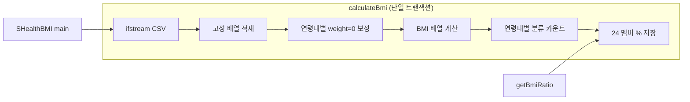

# SHealth 클래스 — 코드 품질 정적 분석 보고서

| 항목 | 내용 |
|------|------|
| 문서 목적 | 레거시 `SHealth` 구현의 SOLID·코드 스멜·결합도·경계값 버그 후보 분석 및 리팩토링 우선순위 제시 |
| 대상 독자 | C++ QA·리팩토링 담당자 |
| 기준 문서 | `docs/requirements_analysis.md`, `README.md`, `.cursorrules` |
| 분석 대상 | `src/main/cpp/SHealth.h`, `SHealth.cpp`, `SHealthBMI.cpp` |
| 코드 변경 | 없음 (본 단계 산출물) |

---

## 1. 요약

| 지표 | 평가 | 핵심 근거 |
|------|------|-----------|
| SRP | **심각 위반** | `calculateBmi` 한 메서드에 로드·보정·BMI·집계·24개 필드 갱신이 혼재 |
| OCP | **위반** | 연령대·범주·API 코드 추가 시 멤버 변수·`if-else`·`getBmiRatio` 분기 동시 수정 |
| LSP | **해당 약함** | 상속 계층 없음; 단일 구체 클래스 |
| ISP | **위반** | 클라이언트가 `calculateBmi` 전체 파이프라인을 암묵적으로 의존 |
| DIP | **위반** | 파일 I/O·도메인 규칙·저장 구조가 구체 클래스에 직접 결합 |
| Magic Number | **다수** | BMI 경계·연령·type 코드·배열 크기·100(%) 하드코딩 |
| DRY | **심각** | 연령대 루프 3회 + `a==20/30/…` 6분기 + `getBmiRatio` 24분기 |
| 경계값 | **결함 후보 3건+** | BMI=25 미분류, `ageCount==0`·`sum==0` 0 나누기, `height==0` |
| 테스트 용이성 | **낮음** | 순수 함수 단위 분리 불가, 전역적 멤버 상태·부작용 |

---

## 2. SOLID 원칙 위반 분석

### 2.1 SRP (단일 책임 원칙)

| 책임(요구 P-04·F-01) | 현재 위치 | 위반 정도 | 근거 |
|----------------------|-----------|-----------|------|
| CSV 파일 열기·파싱 | `calculateBmi` L8–25 | 높음 | `ifstream`, `split`, `stoi`/`stod` |
| 체중 0 연령대 보정 | `calculateBmi` L28–47 | 높음 | 연령대 이중 루프·평균 대입 |
| BMI 산출 | `calculateBmi` L50–53 | 중간 | 키 cm→m, 제곱 |
| 4단계 분류·카운트 | `calculateBmi` L55–74 | 높음 | 분류 조건 + 연령 필터 |
| 연령대별 비율(%) 저장 | `calculateBmi` L76–106 | 높음 | 24개 멤버에 개별 대입 |
| 비율 조회 API | `getBmiRatio` L111–136 | 중간 | 조회만 담당하나 선행 `calculateBmi` 필수 |
| 문자열 split 유틸 | `split` (private) | 낮음 | 파싱 책임의 일부 |

**판정**: `SHealth`는 **데이터 접근·변환·도메인 규칙·집계·조회**를 단일 God Method(`calculateBmi`, ~100줄)와 24개 평면 멤버로 처리한다. 요구사항 §7.1의 `DataLoader` / `ImputationService` / `BmiCalculator` 등 분리 목표와 정면으로 불일치한다.

### 2.2 OCP (개방-폐쇄 원칙)

| 확장 시나리오 | 수정 지점 | 위반 내용 |
|---------------|-----------|-----------|
| 연령대 80대 추가 | `ages` 루프 상한, 멤버 4×N개, L76–106, `getBmiRatio` 4분기 | 코드·헤더 동시 확장, 루프로 흡수 불가 |
| BMI 범주 5단계(예: 고도비만) | 분류 `if-else`, type `400` 외 코드, 저장 필드 | 분기·멤버 선형 증가 |
| type을 enum/문자열로 변경 | `getBmiRatio` 24개 `else if` 전면 수정 | 테이블 드리븐 미적용 |
| 입력 소스 DB/JSON | `calculateBmi` 내부 `ifstream` | 인터페이스 없이 메서드 전체 교체 |

**판정**: 변화에 **수정(open for modification)** 만 가능하고 **확장(extension)** 으로 흡수하기 어렵다. 2차 로드맵의 테이블·`std::array`·루프 기반 집계가 OCP 완화의 핵심이다.

### 2.3 LSP (리스코프 치환 원칙)

| 항목 | 분석 |
|------|------|
| 상속/다형성 | 없음 (`class SHealth` 단독) |
| 계약 | `calculateBmi` 실패 시 `0` 반환 vs 성공 시 `count` — 호출자가 구분 가능하나, 실패 후 `getBmiRatio` 호출 시 **이전 실행 잔여 상태** 가능(멤버 초기화는 `count`만, 비율 필드는 재초기화 안 함) |
| 판정 | LSP 위반은 **해당 없음~낮음**. 대신 **상태 기반 API 계약** 불명확이 유사 리스크 |

### 2.4 ISP (인터페이스 분리 원칙)

| 클라이언트 니즈 | 강제되는 의존 | 위반 |
|-----------------|---------------|------|
| 20대 저체중 비율만 필요 | `calculateBmi` 전체(파일·보정·전 연령대 집계) | 높음 |
| BMI 단건 계산 테스트 | 파일·CSV·멤버 배열 | 높음 |
| 파싱만 검증 | BMI·통계까지 실행 | 높음 |

**판정**: **Fat Class** — 좁은 조회(`getBmiRatio`)를 위해 넓은 파이프라인(`calculateBmi`)에 묶인다. 5단계(SRP) 이후 얇은 파사드 + 세분 API가 ISP에 부합한다.

### 2.5 DIP (의존성 역전 원칙)

| 고수준 정책 | 저수준 구현에 직접 의존 | 위반 |
|-------------|------------------------|------|
| “연령대 평균 보정” | `double` 고정 배열, 인덱스 `count` | 구체 저장소에 결합 |
| “CSV에서 로드” | `std::ifstream`, 경로 문자열 | I/O 추상화 없음 |
| “한국 BMI 4단계” | 리터럴 `18.5`, `23`, `25` 산재 | 도메인 상수·`BmiClassifier` 부재 |
| 출력 | `SHealthBMI.cpp`가 `SHealth` 구체 타입에 직접 의존 | 테스트 더블·목 주입 불가 |

**판정**: **안정적인 추상화(인터페이스/순수 함수) 없이** 구현 세부(파일, 배열 크기, 멤버 레이아웃)에 상위 로직이 종속된다.

---

## 3. Magic Number 및 하드코딩

| 값 | 출현 위치 | 의미(도메인) | 권장 명명 상수/타입 |
|----|-----------|--------------|---------------------|
| `18.5` | `SHealth.cpp` L65–67 | 저체중 상한 | `kBmiUnderweightMax` |
| `23` | L67–69 | 정상 상한 / 과체중 하한 | `kBmiNormalMax`, `kBmiOverweightMin` |
| `25` | L69–71 | 과체중 상한 / 비만 하한 | `kBmiOverweightMax`, `kBmiObesityMin` |
| `100.0` | L52, L77–104 | cm→m, 비율 % | `kCmPerMeter`, `kPercentScale` |
| `20`, `30`, … `70`, `step 10` | L29, L56, `getBmiRatio` | 연령대 클래스 | `kAgeClassMin`, `kAgeClassMax`, `kAgeClassStep` |
| `100`, `200`, `300`, `400` | `getBmiRatio`, `SHealthBMI.cpp` | BMI 범주 type 코드 | `enum class BmiCategory : int` |
| `10000` | `SHealth.h` L13–16 | 최대 레코드(암묵) | `kMaxRecords` 또는 `vector` 동적 |
| `100` (멤버 접미) | `underweight20` 등 24개 | 연령대×범주 평면 저장 | `std::array<std::array<double,4>,6>` 등 |
| `0.0` | L34, L43 | 체중 누락 | `kMissingWeight` (또는 `optional`) |
| `4` (암묵) | 분류·type 4종 | 범주 수 | `kBmiCategoryCount` |

**부가 스멜**: `type`이 `100/200/300/400`으로 **연속적이지 않아** `switch`·배열 인덱싱에 불리하다 (의도적 레거시 API이면 enum + 매핑 테이블로 캡슐화).

---

## 4. 중복 분기 (DRY)

### 4.1 연령대 구간 판별

| 패턴 | 반복 횟수 | 코드 위치 | 중복 내용 |
|------|-----------|-----------|-----------|
| `for (int a = 20; a <= 70; a += 10)` | 3회 | L29, L56, (보정·집계 각 1) | 동일 연령 스캔 |
| `ages[i] >= a && ages[i] < a + 10` | 4회+ | L33, L42, L63 | 구간 멤버십 |
| `if (a == 20) … else if (a == 30) …` | 6분기 | L76–105 | 동일 식 `(double)count * 100 / sum` × 4 범주 |

**개선 방향(1차)**: 연령 인덱스 `idx = (a - 20) / 10`, 비율 배열 `ratios[idx][category]` 한 번에 대입.  
**개선 방향(2차)**: `AgeCohortStatistics::aggregate(records)` 단일 패스.

### 4.2 `getBmiRatio` 스위치형 분기

| 항목 | 수치 |
|------|------|
| `else if` 체인 | 24개 (6 연령 × 4 type) |
| 유효하지 않은 `(ageClass, type)` | `0.0` (L136) — 오류와 “실제 0%” 구분 불가 |
| 대칭 구조 | `ageClass` 외부 루프 + `type` 인덱스로 **4~6줄**로 축소 가능 |

```111:136:src/main/cpp/SHealth.cpp
double SHealth::getBmiRatio(int ageClass, int type) {
    if (ageClass == 20 && type == 100) return underweight20;
  // ... 22개 동일 패턴 ...
    return 0.0;
}
```

### 4.3 BMI 분류 조건

| 문제 | 코드 | 요구(§3.4) 대비 |
|------|------|-----------------|
| 정상: `> 18.5 && < 23` | L67 | `else if (bmi < 23)` — **18.5는 저체중과 중복 조건**이나 의도상 양립 |
| 비만: `> 25` (등호 제외) | L71 | 요구: `else → 비만` (**BMI=25 누락**) |
| 과체중: `>= 23 && < 25` | L69 | BMI=25 시 과체중·비만 모두 false |

---

## 5. 결합도 분석 (로딩 · 보정 · BMI · 통계)



| 결합 유형 | 설명 | 심각도 |
|-----------|------|--------|
| **시간적 결합** | `getBmiRatio`는 `calculateBmi` 완료 후만 유효 | 높음 |
| **데이터 결합** | `ages/heights/weights/bmis` + 24 비율 멤버가 한 객체에 공존 | 높음 |
| **순서 결합** | 보정 → BMI → 집계 순서 변경 시 결과 깨짐 (문서화·함수 경계 없음) | 높음 |
| **I/O 결합** | 도메인 계산이 파일 경로·CSV 형식에 묶임 | 중간 |
| **표현 결합** | 집계 결과가 `underweight20` 등 **이름으로 연령·범주 인코딩** | 높음 (OCP·DRY 악화) |

| 단계 | 입력 | 출력 | 독립 테스트 가능? |
|------|------|------|-------------------|
| 로딩 | 파일 경로 | `vector<Record>` | 현재 **불가** (파일 필수) |
| 보정 | 레코드 + 연령 정책 | 보정된 weight | **불가** (배열 in-place) |
| BMI | weight, height | bmi | **불가** (루프 내 인라인) |
| 분류 | bmi | category enum | **불가** |
| 통계 | records + categories | 비율 테이블 | **불가** |

---

## 6. 경계값 버그 후보

| ID | 조건 | 코드 근거 | 요구/기대 | 위험 |
|----|------|-----------|-----------|------|
| B-01 | **BMI = 25.0** | L71 `bmis[i] > 25` only obesity; L69 `< 25` overweight | §3.4: 비만 | **4분류 누락**, R-01 위반(합 ≠ sum) |
| B-02 | **BMI = 18.5** | L65 `<= 18.5` 저체중 | README 저체중 | png와 상이하나 코드·README 일치 — **의도 확인 후 TC-38** |
| B-03 | **BMI = 23.0** | L67–69 | 과체중 | 현재 `>= 23` — **요구와 일치** |
| B-04 | 연령대 **전원 weight=0** | L44 `sum / ageCount`, ageCount=0 | §4.3 방어 필요 | **UB / inf / NaN**, TC-20 |
| B-05 | 연령대 **무인원** (sum=0) | L77–104 `(double)*100/sum` | §5.3 | **0 나누기**, TC-30 |
| B-06 | **height = 0** | L52 분모 0 | §4.4 보정 미구현 | **inf BMI**, TC-22 |
| B-07 | **count ≥ 10000** | 배열 고정, `count++` 무검사 | — | **버퍼 오버플로우** |
| B-08 | 빈 줄 `tokens.empty()` | L18–19 `break` | D-02 | 첫 빈 줄에서 **이후 데이터 무시** 가능 |
| B-09 | `calculateBmi` 실패 | L11 return 0 | §6.4 | **이전 비율 멤버 잔존** (count만 0) |
| B-10 | 잘못된 `getBmiRatio` 인자 | L136 return 0.0 | §6.4 | **오류 vs 0%** 구분 불가 |

**분류 로직 vs 요구 의사코드 (요약)**

| BMI | 요구 §3.4 | 현행 `SHealth.cpp` | 일치 |
|-----|-----------|-------------------|------|
| ≤ 18.5 | 저체중 | 저체중 | O |
| (18.5, 23) | 정상 | `>18.5 && <23` | O |
| [23, 25) | 과체중 | `>=23 && <25` | O |
| ≥ 25 | 비만 | `>25` only | **X (25 누락)** |

---

## 7. 기타 코드 스멜 (모던 C++ 관점)

| 스멜 | 위치 | 설명 |
|------|------|------|
| God Method | `calculateBmi` | 테스트·재사용·리뷰 모두 어려움 |
| Data Clumps | 24× `double` + 4× 배열 | `struct AgeCohortStats` / 2D 배열로 응집 |
| Primitive Obsession | `ageClass`, `type` as `int` | `enum class` + `std::optional<double>` |
| Feature Envy | — | (해당 약함) |
| Comment as deodorant | L15, L28, L50, L55 | 단계 주석 = 메서드 추출 신호 |
| C 스타일 캐스트 | `(double)underweight` | `static_cast<double>` |
| 비일관 반환 | `calculateBmi` → `int`, 비율 → `double` | 의미는 명확하나 실패 계약 혼재 |
| `file.close()` | L26 | RAII(`ifstream` 소멸)로 충분 |
| 예외 미처리 | `stoi`/`stod` | 잘못된 CSV 시 `std::exception` 전파 가능 |

---

## 8. 리팩토링 우선순위 (1~5)

워크플로우: **1차 = 3단계(동작 보존 클린코드)**, **2차 = 6단계 로드맵(구조·SRP·STL)**. 아래 우선순위는 **1차에서 먼저 할 것(1~3)** 과 **2차·5단계로 넘길 것(4~5)** 을 구분한다.

| 우선순위 | 항목 | 단계 | 근거 | 기대 효과 | 리스크 |
|----------|------|------|------|-----------|--------|
| **1** | **매직 넘버 상수화** (`18.5`, `23`, `25`, `100.0`, 연령 20~70, type 100~400, `10000`) | 1차(3) | 변경 범위 국소·동작 동일; `.cursorrules` 명시; 이후 분기 통합의 전제 | 가독성·결함 수정(25) 시 단일 수정점 | 상수 이름만 바꾸고 경계 로직은 4단계까지 유보 |
| **2** | **`calculateBmi` 단계별 private 함수 추출** (load / imputeWeight / computeBmi / aggregateRatios) | 1차(3) | SRP 1차 완화; `SHealthBMI` 출력 baseline 비교 용이 | 메서드 단위 수동 검증 가능 | 추출 중 실수로 순서·경계 변경 → 빌드 후 출력 diff 필수 |
| **3** | **연령대·`getBmiRatio` DRY (루프 + 2D `std::array` 또는 `ratios[6][4]`)** | 1차(3)~4단계 경계 | L76–105, L111–135 중복 제거; OCP·DRY 동시 개선 | ~150줄 → ~40줄급; 신규 연령대는 크기 상수만 | 멤버 레이아웃 변경 시 `getBmiRatio` 동작 회귀 — Golden 전 baseline |
| **4** | **경계값·0 나누기 결함 수정** (BMI=25, `ageCount==0`, `sum==0`, 선택적 height=0) | **4단계(결함)** + 5단계 일부 | 요구 §3.3·§4.3·§5.3·부록 A; **동작 변경** → 1차 원칙(보존)과 분리 | 정확도·안정성 | 출력 수치 변동 → `defect_list.md` + baseline 갱신 |
| **5** | **SRP 컴포넌트 분리 + DIP** (Record, Loader, Imputation, BmiCalculator, Classifier, AgeCohortStatistics, 파사드) + `vector`·테스트 주입 | 2차(6)·5단계 | F-01·§7.1; 8단계 TDD 전 구조 확보 | 단위 테스트·F-03~F-05 API | 범위 크기; 3단계에서 일부 하지 말 것(`.cursorrules`) |

---

## 9. 단계별 로드맵 매핑

### 9.1 1차 리팩토링 (3단계) — 권장 작업 순서

| 순서 | 작업 | 우선순위 | 완료 검증 |
|------|------|----------|-----------|
| 3-1 | named constants (`namespace` 또는 `constexpr`) | P1 | 빌드 |
| 3-2 | `split` 유지, `loadFromCsv`, `imputeMissingWeights`, `computeAllBmi`, `computeAgeCohortRatios` 추출 | P2 | `SHealthBMI` 출력 동일 |
| 3-3 | 집계·`getBmiRatio` → `ratios[cohortIdx][catIdx]` + 이중 루프 | P3 | 6연령×4 type 수치 동일 |
| 3-4 | (선택) `static_cast`, 불필요 `close()` 정리 | — | 빌드 |

**3단계에서 하지 않을 것**: BMI=25 로직 수정, height 보정, public API 대개편, 대량 gtest 추가.

### 9.2 2차 리팩토링 로드맵 (6단계) — 6단계 체크리스트

| 6단계 항목 | 내용 | 선행 |
|------------|------|------|
| 6-1 | `PersonRecord` / `vector<PersonRecord>` — 고정 `10000` 제거 | 3단계 DRY |
| 6-2 | `BmiClassifier::classify(double)` — 단일 분기·경계 확정 | 4단계 결함 확정 |
| 6-3 | `ImputationService` (weight, height 대칭) | F-03 |
| 6-4 | `ICsvReader` 또는 `load(std::istream&)` — DIP | 6-1 |
| 6-5 | `AgeCohortStatistics` + 전체 비율 API (F-05) | 6-2 |
| 6-6 | 정상 BMI 사용자 목록 API (F-04), `getBmiRatio` type enum 래퍼 | 6-2 |

---

## 10. `SHealthBMI.cpp` 관찰

| 항목 | 내용 |
|------|------|
| 역할 | 통합 스모크·데모 `main` |
| 결합 | `SHealth` 구체 클래스 + 매직 `100~400` 반복 24회 |
| 개선 시점 | 3단계 이후 — 로직은 라이브러리에 두고 `main`은 API 호출만 |

---

## 11. 정적 분석 vs 후속 산출물

| 본 문서 항목 | 후속 문서 |
|--------------|-----------|
| B-01, B-04~B-06 | `docs/defect_list.md` (4단계) |
| TC 매핑 | `docs/test_plan.md` (7단계) |
| 6-1~6-6 상세 일정 | `docs/refactoring_plan.md` (6단계) |
| P1~P5 실행 | 3단계 → 4단계 → 5단계 → 6단계 |

---

*문서 버전: 1.0 | 워크플로우 2단계 | 다음 산출물: 3단계 1차 리팩토링 또는 `docs/refactoring_plan.md`(6단계)*
