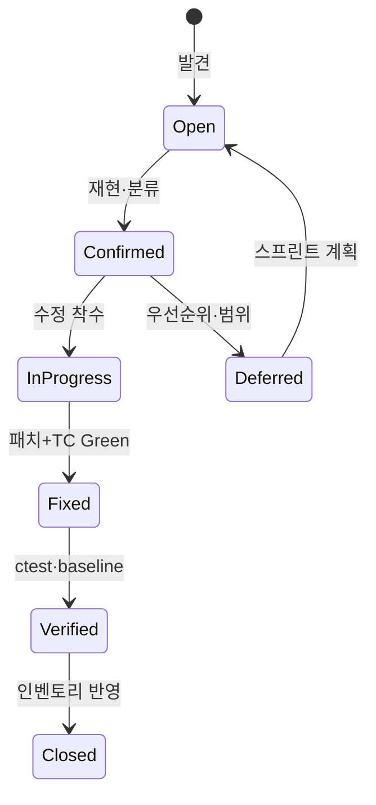
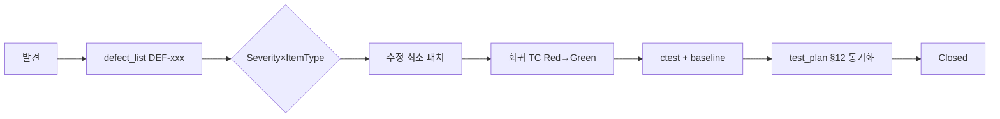

# SHealth BMI — 결함 관리 체계 (프로세스·템플릿)

| 항목 | 내용 |
|------|------|
| 문서 목적 | 결함 **인벤토리**(`docs/defect_list.md`)와 분리된 분류·보고·메트릭·워크플로 정의 |
| 대상 독자 | QA 리드, 결함 분석·TDD·회귀 담당자 |
| 기준 문서 | `docs/requirements_analysis.md`, `docs/test_plan.md`, `docs/defect_list.md` |
| 워크플로우 단계 | **10단계** (결함 관리 프로세스) |
| 연계 산출물 | `docs/qa_final_report.md` (12단계 종합 회고) |

---

## 1. 문서 역할 분리

| 문서 | 역할 | 갱신 시점 |
|------|------|-----------|
| **`defect_list.md`** | DEF-xxx **인벤토리** — 요약, 상태, 재발 방지 TC | 결함 발견·수정·회귀 TC 추가 시 |
| **`defect_report.md` (본 문서)** | **프로세스** — 분류 매트릭스, 보고 템플릿, 메트릭 정의, 이슈 연동 | 프로세스 변경·단계 완료 시 |
| **`test_plan.md` §12** | DEF ↔ TC **매핑** 규칙 | 결함·TC 동기화 시 |
| **`Report/NN.*-report-*.md`** | 단계별 **실행 기록** (검증 수치 스냅샷) | 해당 단계 완료 후 |

---

## 2. Severity × ItemType 분류 매트릭스

### 2.1 Severity (심각도)

| 등급 | 정의 | 수정 SLA (권장) | SHealth 예시 |
|------|------|-----------------|--------------|
| **Critical** | 데이터 손상·보안 침해·프로세스 크래시로 서비스 불가 | 즉시 (핫픽스) | (현재 인벤토리 없음) `count` 무제한 적재로 OOB → Critical 후보 |
| **High** | 요구 기능 오동작·집계 왜곡·0 나누기·NaN/inf 전파 | 1 스프린트 내 | DEF-001 BMI=25 미분류, DEF-002 sum=0, DEF-003 ageCount=0 |
| **Medium** | 부분 기능·상태 오염·예외 미처리(크래시 가능) | 2 스프린트 내 | DEF-004 실패 시 비율 잔존, DEF-008 파싱 예외, DEF-005 height=0 |
| **Low** | 우회 가능·엣지 입력·문서와 미세 불일치 | 백로그 | DEF-006 빈 줄, DEF-007 상한 cap |

**승격 규칙:** 동일 Root Cause가 **2건 이상** 재발하거나, `shealth.dat` 전체 집계 수치가 baseline과 어긋나면 **한 단계 상향** 검토한다.

### 2.2 ItemType (5종)

| ItemType | 정의 | SHealth 검출 관점 | 인벤토리 건수 |
|----------|------|-------------------|---------------|
| **Functional** | README·요구사항 대비 **결과·분류·API 계약** 불일치 | BMI 경계, 보정, `getBmiRatio` 계약 | 4 (DEF-001, 004, 005, 006) |
| **Reliability** | 크래시, UB, NaN/inf, **상태 잔존**, 리소스 한계 | 0 나누기, 예외 전파, 버퍼 상한 | 4 (DEF-002, 003, 007, 008) |
| **Performance** | 응답 시간·메모리·처리량 (명시 요구 없을 때 관찰) | `kMaxRecords` 대용량, 전체 스캔 | 0 |
| **Security** | 입력 조작·OOB·비인가 데이터 노출 | CSV 악성 입력, 배열 상한 | 0 (DEF-007은 Reliability로 분류, Security 병행 검토 가능) |
| **Maintainability** | 테스트·구조·가독성 — **동작은 맞으나 결함 유발 구조** | God Method, 중복 분기, private 미검증 | 0 (코드 품질은 `code_quality_report.md`) |

> **분류 원칙:** 사용자 가시 증상(잘못된 비율·분류) → **Functional** 우선. 크래시·UB·예외·버퍼 → **Reliability**. 둘 다 해당 시 **더 높은 Severity** 기준으로 ItemType을 **Reliability**로 둔다.

### 2.3 Severity × ItemType 매트릭스 (대응·조치)

셀 값: **P** = 즉시 수정 + 회귀 TC 필수, **T** = 수정 + TC 권장, **D** = 문서화·모니터링(Deferred), **—** = 해당 조합 희소·별도 정책

| Severity ↓ / ItemType → | Functional | Reliability | Performance | Security | Maintainability |
|-------------------------|------------|-------------|---------------|----------|-----------------|
| **Critical** | P | P | P | P | T |
| **High** | P | P | T | P | T |
| **Medium** | P | P | D | P | D |
| **Low** | T | T | D | T | D |

**SHealth DEF-001~008 배치 (참고)**

| DEF-ID | Severity | ItemType | 매트릭스 조치 |
|--------|----------|----------|---------------|
| DEF-001 | High | Functional | P |
| DEF-002 | High | Reliability | P |
| DEF-003 | High | Reliability | P |
| DEF-004 | Medium | Functional | P |
| DEF-005 | Medium | Functional | P |
| DEF-006 | Low | Functional | T |
| DEF-007 | Low | Reliability | T |
| DEF-008 | Medium | Reliability | P |

### 2.4 상태(Status) 전이



| 상태 | 의미 | `defect_list.md` 표기 예 |
|------|------|--------------------------|
| Open | 재현됨, 미수정 | Open |
| Fixed | 코드·TC 반영 | Fixed (5단계 TDD), Fixed (6단계) |
| Deferred | 요구·일정상 유보 | Deferred |
| Closed | 검증 완료·회귀 포함 | Fixed + test_plan §12 Green |

---

## 3. 결함 보고서 템플릿

신규 결함은 아래 필드를 **`docs/defect_list.md`에 DEF-xxx 블록**으로 기록한다. 본 절은 **작성 규격(템플릿)** 이다.

### 3.1 메타데이터 (필수)

```markdown
## DEF-XXX — <한 줄 제목>

| 필드 | 내용 |
|------|------|
| **Severity** | Critical \| High \| Medium \| Low |
| **ItemType** | Functional \| Reliability \| Performance \| Security \| Maintainability |
| **Status** | Open \| InProgress \| Fixed \| Deferred \| Closed |
| **FoundIn** | 5단계(TDD) \| 6단계(정적) \| 7단계(기능) \| 운영 \| 기타 |
| **RequirementRef** | requirements_analysis §x.x (또는 README §) |
| **RegressionTC** | TP-Px-xx, EX-xx (`test_plan.md` §12) |
```

### 3.2 본문 (재현 / 기대 / 실제 / 원인 / 수정 / 검증)

| 섹션 | 작성 지침 |
|------|-----------|
| **Steps (재현)** | 번호 목록. 입력 파일·픽스처 경로·호출 API·전제 조건 명시 |
| **Expected (기대)** | 요구사항·README·Oracle 한 문장 + 수치/반환값 |
| **Actual (실제)** | 수정 **전** 관측값. 스크린샷 대신 수치·반환코드·stderr |
| **Root Cause (원인)** | 코드 위치·논리 오류(예: `>` vs `≥`, 초기화 누락) |
| **Fix Summary (수정)** | 최소 변경 요약. 동작 보존 리팩토링과 구분 |
| **Verification (검증)** | `ctest` 테스트명, baseline diff 여부, 수동 `SHealthBMI` 필요 시 명시 |

### 3.3 작성 예시 (DEF-001 축약)

```markdown
**Steps**
1. `classifyBmiCategory(25.0)` 호출.

**Expected**
- BMI ≥ 25 → 비만 (requirements_analysis §3.4).

**Actual (수정 전)**
- `bmi > 25`만 비만 → 25.0 누락, 4범주 합 < sum.

**Root Cause**
- 비만 하한 등호 누락.

**Fix Summary**
- `else` → `BmiCategoryIndex::Obesity` (≥25).

**Verification**
- TP-P2-07, TP-P3-11, EX-04 Green; `ctest` 전체 통과.
```

### 3.4 체크리스트 (보고 품질)

- [ ] Severity·ItemType이 §2 매트릭스와 일치하는가?
- [ ] Expected가 `requirements_analysis.md` 절 번호와 연결되는가?
- [ ] Actual이 수정 **전** 상태인가?
- [ ] RegressionTC가 `test_plan.md` §12에 등록·동기화되었는가?
- [ ] baseline(`refactor_baseline_output.txt`) 변경 시 **갱신 사유**를 Verification에 적었는가?

---

## 4. 품질 메트릭

### 4.1 수집 주기·명령

| 메트릭 | 수집 시점 | 명령 / 출처 |
|--------|-----------|-------------|
| 테스트 통과율 | 5·6·7·9·12단계 완료 시 | `cd build && ctest` |
| 라인·분기 커버리지 | 5단계 Green 후, 12단계 전 | `docs/test_plan.md` §8.2 (`SHEALTH_COVERAGE=ON`) |
| 결함 발견 건수 | 6단계·TC Red 시 | `defect_list.md` 집계 |
| Golden 회귀 | 9단계 | `GoldenMaster_*` 테스트 |

### 4.2 테스트 통과율 (Pass Rate)

| 지표 | 정의 | 목표 | 현재 스냅샷 (2026-05-20) |
|------|------|------|---------------------------|
| **CTest Pass Rate** | `passed / (passed + failed)` × 100% | **100%** (5단계 이후 유지) | **50 / 50 = 100%** |
| **Planned TC Coverage** | `test_plan` ID 중 `SHealthBMITest`에 구현된 비율 | P0~P3 필수 ID 100% | P0~P3·EX·Golden·F-04/05 구현 완료 |
| **DEF Regression Coverage** | Fixed DEF 중 회귀 TC 1건 이상 | 100% | **8 / 8 = 100%** (DEF-007 Phase 7 TC 포함) |

### 4.3 코드 커버리지 (Coverage)

| 대상 | 라인 | 분기 | 비고 |
|------|------|------|------|
| `SHealth.cpp` | **≥ 90%** | **≥ 85%** | `test_plan.md` §8.1 목표 |
| 측정 절차 | — | — | CMake `-DSHEALTH_COVERAGE=ON` → `ctest` → `lcov` / `genhtml` |

**갱신 방법 (요약)**

```bash
cmake -B build -DSHEALTH_COVERAGE=ON
cmake --build build
cd build && ctest
# gcov / lcov — test_plan.md §8.2 전체 명령 참조
```

> 12단계 `qa_final_report.md` 작성 전 **반드시** 최신 `ctest`·lcov 수치를 재측정해 본 절 스냅샷을 갱신한다.

### 4.4 6단계 정적 분석 vs 5단계 TC 발견율

**정의 (리팩토링 우선 워크플로)**

| 구분 | 단계 | 활동 | 발견 근거 태그 |
|------|------|------|----------------|
| **정적(6단계)** | 6 — 결함 분석·수정 | 요구사항·경계값·코드 대조, 체크리스트, 수동 `SHealthBMI` | `FoundIn: 6단계(정적)` |
| **TC(5단계)** | 5 — TDD | Red 테스트 작성·실패로 노출 | `FoundIn: 5단계(TDD)` |

**집계 규칙:** 최초 **재현·기록**된 단계를 `FoundIn`으로 한다. 양쪽에서 동시에 식별되면 **먼저 TC/패치에 반영된 단계**를 우선한다.

#### SHealth BMI 인벤토리 (DEF-001~008)

| DEF-ID | FoundIn (최초) | 검출 수단 | ItemType |
|--------|----------------|-----------|----------|
| DEF-001 | 5단계 TDD | TP-P2-07 Red | Functional |
| DEF-002 | 5단계 TDD | TP-P3-10 / EX-01 | Reliability |
| DEF-003 | 5단계 TDD | TP-P1-04 / EX-02 | Reliability |
| DEF-004 | 5단계 TDD | EX-06 | Functional |
| DEF-005 | 5단계 TDD + 7단계 기능 | TP-P1-07/08, F-03 | Functional |
| DEF-006 | 6단계 정적 | 요구 D-02 vs `break` | Functional |
| DEF-007 | 6단계 정적 | `kMaxRecords` 상한 검토 | Reliability |
| DEF-008 | 6단계 정적 | `stoi`/`stod` 예외 경로 | Reliability |

#### 발견율 비교

| 발견 경로 | 건수 | 비율 | 비고 |
|-----------|------|------|------|
| **5단계 TC(TDD)** | 5 | **62.5%** | DEF-001~005 |
| **6단계 정적** | 3 | **37.5%** | DEF-006~008 |
| **합계** | 8 | 100% | |

| ItemType | 5단계 TC | 6단계 정적 |
|----------|----------|------------|
| Functional | 3 | 1 |
| Reliability | 2 | 2 |
| Performance | 0 | 0 |
| Security | 0 | 0 |
| Maintainability | 0 | 0 |

| Severity | 5단계 TC | 6단계 정적 |
|----------|----------|------------|
| High | 3 | 0 |
| Medium | 2 | 1 |
| Low | 0 | 2 |

**해석 (QA 회고용)**

1. **경계값·도메인 로직**(BMI 25, sum=0, weight 전원 0)은 **5단계 TDD**에서 조기에 잡히는 비율이 높다 — `test_plan` §5 경계 매트릭스가 유효했다.
2. **CSV 파싱·방어 코드**(빈 줄, 상한, 예외)는 **6단계 정적**에서 요구·코드 불일치로 발견 — 통합 픽스처(TC)는 수정 **후** 회귀에 기여.
3. **권장:** 6단계 체크리스트에 `loadFromCsv`·파일 I/O 항목을 고정하고, 5단계에서는 P3·파일 경계(§5.3) TC를 Red로 **선행** 작성해 발견 시점을 앞당긴다.

### 4.5 경계값 발견율 (보조 메트릭)

`requirements_analysis.md` §3.3·§5 경계와 `test_plan.md` §5 매트릭스 대비:

| 경계 항목 | 결함 연계 | 회귀 TC | 상태 |
|-----------|-----------|---------|------|
| BMI 18.5 | — | TP-P2-02 | Green |
| BMI 23 / 25 | DEF-001 | TP-P2-05~07, TP-P3-11 | Green |
| sum=0 | DEF-002 | TP-P3-10 | Green |
| ageCount=0 (weight) | DEF-003 | TP-P1-04 | Green |
| height=0 | DEF-005 | TP-P1-07/08 | Green |
| 연령 19/20/29/30 | — | TP-P3-01~04 | Green |
| CSV 빈 줄·파싱·상한 | DEF-006~008 | TP-P3-17, 18, cap TC | Green |

**경계 커버리지 (질적):** 필수 경계 **12 / 12** 항목에 TC 또는 DEF 수정으로 대응 완료.

---

## 5. 결함 처리 워크플로 (요약)



| 순서 | 담당 | 산출 |
|------|------|------|
| 1 | 분석 | DEF-xxx 초안 (§3 템플릿) |
| 2 | 개발 | 코드 수정 (동작 보존 원칙 — `.cursorrules`) |
| 3 | QA | `SHealthBMITest` 회귀 TC |
| 4 | QA | `ctest` 100%, 필요 시 `refactor_baseline_output.txt` 갱신 |
| 5 | QA | `defect_list.md` 상태·`test_plan.md` §12 매핑 |

---

## 6. (선택) GitHub Issues 연동 워크플로

원격 이슈 트래킹을 쓸 때 **DEF-xxx ↔ Issue #** 를 1:1로 유지한다.

### 6.1 라벨 체계

| 라벨 | 용도 |
|------|------|
| `defect` | 결함 공통 |
| `severity:critical` … `severity:low` | §2.1 |
| `type:functional` … `type:maintainability` | §2.2 |
| `found:static` / `found:tdd` | §4.4 |
| `status:fixed` / `status:deferred` | 상태 |

### 6.2 이슈 본문 템플릿

```markdown
## DEF-XXX — <제목>
- **Severity:** High
- **ItemType:** Reliability
- **RequirementRef:** requirements_analysis §5.3

### 재현 (Steps)
1. ...

### 기대 (Expected)
...

### 실제 (Actual)
...

### 원인 (Root Cause)
...

### 수정 (Fix Summary)
...

### 검증 (Verification)
- [ ] ctest: `SHealthBMITest.*`
- [ ] baseline unchanged / updated with reason
```

### 6.3 연동 흐름

1. **생성:** `defect_list`에 DEF-xxx 추가 → `gh issue create` — 본문 §6.2, 라벨 부여.
2. **브랜치:** `fix/DEF-xxx-short-desc` — PR 제목에 `DEF-XXX` 포함.
3. **PR 본문:** `Closes #NN`, 회귀 TC 이름, baseline diff 요약.
4. **종료:** `ctest` Green 확인 후 이슈 Close — `defect_list` Status → Closed.

**CLI 예시**

```bash
gh issue create --title "DEF-009: <제목>" --label "defect,severity:medium,type:functional" --body-file issue_body.md
gh pr create --title "fix: DEF-009 <제목>" --body "Closes #NN\n\n## Verification\n- ctest Green\n- TC: SHealthFixture...."
```

> 이슈를 쓰지 않는 로컬·교육 프로젝트는 **`defect_list.md`만**으로 §3~§5 프로세스를 적용하면 된다.

---

## 7. 동기화·갱신 절차

| 이벤트 | 갱신 대상 |
|--------|-----------|
| 신규 DEF | `defect_list.md`, `test_plan.md` §12, (선택) GitHub Issue |
| TC 추가·이름 변경 | `test_plan.md` §12, 본 문서 §4.2~4.4 스냅샷 |
| 12단계 QA 종합 | `qa_final_report.md` — 본 문서 §4 메트릭 **최신 수치** 인용 |
| 프로세스 변경 | **본 문서** 버전 상향 |

---

## 부록 A. `defect_list.md` 등록 요청 양식 (Copy-Paste)

```markdown
## DEF-XXX — <제목>

| 필드 | 내용 |
|------|------|
| **Severity** | |
| **ItemType** | |
| **Status** | Open |
| **FoundIn** | 5단계(TDD) \| 6단계(정적) |

**Steps**
1.

**Expected**

**Actual (수정 전)**

**Root Cause**

**Fix Summary**

**Verification**

**재발 방지 TC:**
```

---

*문서 버전: 1.0 | 워크플로우 10단계 | 인벤토리: `docs/defect_list.md` | 다음: `docs/qa_final_report.md` (12단계)*
