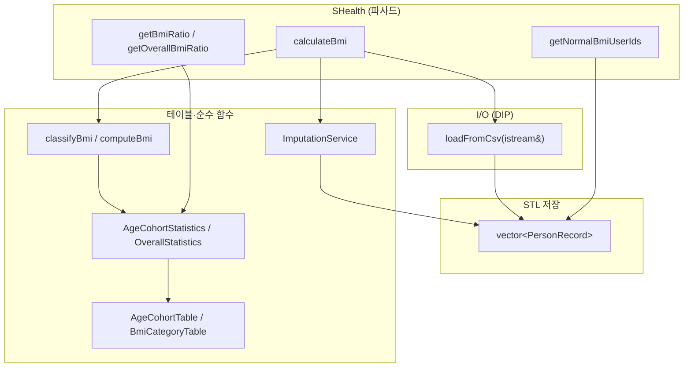

# SHealth 2차 구조 개선 로드맵

| 항목 | 내용 |
|------|------|
| 문서 목적 | 1차 리팩토링·결함 수정·5단계 TDD·기능 개선(F-01~F-05) **이후** 코드 기준선에서 2차 구조 개선을 **Phase 단위**로 실행하기 위한 체크리스트 |
| 대상 독자 | C++ QA·리팩토링 담당자 |
| 기준 문서 | `docs/requirements_analysis.md`, `docs/code_quality_report.md`, `docs/defect_list.md`, `docs/test_plan.md` |
| 기준 코드 | `src/main/cpp/SHealth.h`, `SHealth.cpp`, `SHealthBMI.cpp` |
| 완료 조건(전 Phase) | **각 Phase 종료 시 `ctest` 47/47 Green 유지** (동작·API 계약 불변) |
| 워크플로우 | **6단계** (2차 리팩토링 로드맵) |

---

## 1. 기준선 요약 (Phase 0 입력)

### 1.1 이미 완료된 1차·5단계 성과

| 영역 | 현행 상태 (Phase 0~3 반영) | 2차에서 남은 과제 |
|------|---------------------------|-------------------|
| God Method | `calculateBmi` → load / impute / BMI / cohort·overall 집계 | **Phase 4** 컴포넌트 파일 분리·테스트 주입 |
| DRY·`getBmiRatio` | `cohortRatios_[cohort][cat]` + `domain::` 테이블 lookup (**완료**) | — |
| 매직 넘버 | `BmiDomain.h` 단일 `constexpr`·enum (**완료**) | — |
| 결함 | DEF-001~008 Fixed (`defect_list.md`) | Phase마다 **회귀 TC** 유지 |
| 기능(F-03~F-05) | height 보정, `getOverallBmiRatio`, `getNormalBmiUserIds` | API 시그니처 **유지** |
| 네임스페이스 | `shealth::detail::{csv,impute,stats}` — **Phase 4** 별도 `.h`/`.cpp` | — |
| 저장소 | `vector<PersonRecord> records_` (**Phase 1 완료**) | — |

### 1.2 Green 유지 검증 명령 (모든 Phase 공통)

```powershell
cd D:\DEV\SHealth_09\build
cmake --build .
ctest --output-on-failure
```

```bash
cd build && cmake --build . && ctest --output-on-failure
```

| 추가 수동 확인 (선택) | 명령 | 기대 |
|----------------------|------|------|
| 데모 출력 | `.\SHealthBMI.exe` (또는 `build\SHealthBMI.exe`) | `docs/refactor_baseline_output.txt`와 6연령×4비율 일치 |
| 단일 테스트 | `ctest -R GetBmiRatio_ShealthDat_MatchesBaseline` | Pass |

### 1.3 변경 금지 계약 (Phase 전체)

- Public API: `calculateBmi`, `getBmiRatio`, `getOverallBmiRatio`, `getNormalBmiUserIds` 시그니처·의미 유지.
- BMI 4단계·연령 구간·보정 규칙: `requirements_analysis.md` §3~§5 및 `defect_list.md` 확정값 유지.
- `getBmiRatio(ageClass, type)` — `ageClass` 20/30/…/70, `type` 100/200/300/400, 무효 시 `0.0`.

---

## 2. 목표 아키텍처 (2차 종료 시)



| 목표 | 설명 |
|------|------|
| **STL 컨테이너** | `PersonRecord` + `std::vector` — `kMaxRecords` 고정 배열 제거(또는 `reserve`만 유지) |
| **테이블 드리븐** | 연령대 6개·BMI 4범주 메타데이터를 `constexpr` 구조체 배열로 정의 → 루프·조회 일원화 |
| **조회 단순화** | `getBmiRatio` = 인덱스 변환 + 2D 배열 접근(현행 유지·테이블로 매핑 함수 통합) |
| **SRP·DIP** | CSV는 `istream` 기반; 도메인은 파일 경로 무관 |

---

## 3. Phase 로드맵 개요

| Phase | 제목 | 핵심 산출 | Green 전략 |
|-------|------|-----------|------------|
| **0** | 기준선 고정 | 체크리스트·브랜치 | 이미 Green — 회귀 기준 확정 |
| **1** | `PersonRecord` + `vector` | 고정 배열 5개 제거 | 동작 동일·내부만 교체 |
| **2** | 연령대·BMI **메타데이터 테이블** | `AgeCohortDescriptor`, `BmiCategoryDescriptor` | 상수·루프 치환, 로직 불변 |
| **3** | type·ageClass **조회 테이블** | `kBmiCategories` lookup (`BmiDomain.h`) | ✅ Phase 2와 동시 완료 |
| **4** | `shealth::detail` **헤더 분리** | `CsvLoader`·`Imputation`·`Statistics`·`PersonRecord.h` | ✅ 완료 |
| **5** | **istream** 로더 (DIP) | `loadFromCsv(istream&, vector&)` | ✅ 완료 |
| **6** | 파사드·API 정리 | `BmiCategoryType` 오버로드, `SHealthBMI` 테이블 루프 | ✅ 완료 |
| **7** | 상한·성능·문서 | `kMaxCsvRecords`·경고·TC | ✅ 완료 |

**권장 순서:** 0 → 1 → 2 → 3 → (4∥5) → 6 → 7.  
Phase 4·5는 의존성 낮으면 4 후 5 또는 5 후 4.

---

## 4. Phase 0 — 기준선 고정

### 목표

- 2차 작업 전 **47/47 Green**·baseline 출력·결함 수정 상태를 태그/문서로 고정한다.

### 변경 파일

| 파일 | 변경 |
|------|------|
| `docs/refactoring_plan.md` | 본 문서 |
| (선택) `docs/refactor_baseline_output.txt` | `SHealthBMI` 출력 스냅샷 존재 확인 |

### 리스크

| 리스크 | 완화 |
|--------|------|
| baseline 파일 누락 | `TP-P3-12` / `GetBmiRatio_ShealthDat_MatchesBaseline` 실패 시 baseline 재생성 |

### 롤백

- 코드 변경 없음. Git 태그/브랜치만 되돌리면 됨.

### 검증

```powershell
cd D:\DEV\SHealth_09\build; cmake --build .; ctest
```

### 체크리스트

- [x] `ctest`: **47 passed, 0 failed** (2026-05-20)
- [x] `docs/defect_list.md` DEF-001~008 **Fixed** 확인
- [x] `GetBmiRatio_ShealthDat_MatchesBaseline` Pass
- [x] 2차 작업용 브랜치 생성 — `refactor/phase-1-vector` (from `feature` @ `e7bd97c`)
- [x] Git 태그 `phase-0-baseline` (기준선 스냅샷)
- [x] `SHealthBMI` 출력 = `docs/refactor_baseline_output.txt` (diff 없음)
- [x] Phase 1 착수 전 `git status` clean (권장; untracked `cmake_test_discovery_*.json`만 제외)

---

## 5. Phase 1 — 고정 배열 → `vector<PersonRecord>`

### 목표

- `int ids[kMaxRecords]` 등 **5개 병렬 배열**을 `struct PersonRecord { int id; int age; double weight; double height; double bmi; }` + `std::vector<PersonRecord> records_`로 통합한다.
- `count`는 `static_cast<int>(records_.size())` 또는 `records_.size()` 직접 사용으로 정합.

### 변경 파일

| 파일 | 예상 변경 |
|------|-----------|
| `src/main/cpp/SHealth.h` | `PersonRecord` 선언, `records_`, 배열 멤버 삭제 |
| `src/main/cpp/SHealth.cpp` | `detail::csv::loadFromCsv`, `impute`, `stats`, 멤버 함수가 `vector`/`span` 또는 pointer+count로 레코드 접근 |
| `src/test/cpp/SHealthBMITest.cpp` | 변경 없음 (목표) — Friend·픽스처 그대로 |

### 설계 스케치

```cpp
struct PersonRecord {
    int id = 0;
    int age = 0;
    double weight = 0.0;
    double height = 0.0;
    double bmi = 0.0;
};

std::vector<PersonRecord> records_;
```

- `loadFromCsv`: `records_.clear(); records_.push_back(...)` (상한은 Phase 7 또는 `reserve(10000)` + `size()` cap 유지로 **DEF-007** 동작 보존).
- `computeAllBmi`: `records_[i].bmi = computeBmi(...)`.

### 리스크

| ID | 리스크 | 완화 |
|----|--------|------|
| R1-1 | 인덱스·`count` 불일치 | `count` 제거 후 `records_.size()` 단일 소스 |
| R1-2 | `detail` 함수 시그니처 대량 변경 | 1 PR 내 일괄 치환, 빌드 즉시 |
| R1-3 | 성능(재할당) | `records_.reserve(8192)` 등 `shealth.dat` 규모 reserve |

### 롤백

```text
git checkout -- src/main/cpp/SHealth.h src/main/cpp/SHealth.cpp
cmake --build build
ctest
```

### 검증

```powershell
cd D:\DEV\SHealth_09\build
cmake --build .
ctest --output-on-failure
ctest -R "CalculateBmi|GetBmiRatio|GetOverall|GetNormal|Impute"
```

### 체크리스트

- [x] `kMaxRecords` 배열 멤버 **0개** (2026-05-20)
- [x] `records_`만으로 load → impute → BMI → 집계 파이프라인 동작
- [x] **47/47** Green
- [x] `SHealthBMI` 출력 = baseline

---

## 6. Phase 2 — 연령대·BMI 분류 테이블 드리븐

### 목표

- `for (ageClass = 20; …; += 10)` 및 type 코드 `100/200/300/400`를 **`constexpr` descriptor 테이블**로 정의한다.
- `classifyBmiCategory` 경계는 기존 `constexpr` 상수 재사용(로직 변경 없음).

### 변경 파일

| 파일 | 예상 변경 |
|------|-----------|
| `src/main/cpp/BmiDomain.h` (신규) | `AgeCohortDescriptor`, `BmiCategoryDescriptor`, `kAgeCohorts[]`, `kBmiCategories[]` |
| `src/main/cpp/SHealth.cpp` | impute/stats 루프 → `for (const auto& cohort : kAgeCohorts)` |
| `src/main/cpp/SHealth.h` | domain 상수 중복 제거·include |
| `CMakeLists.txt` | `shealth_lib`에 `BmiDomain.h` 포함(헤더 only면 변경 없을 수 있음) |

### 테이블 예시

```cpp
struct AgeCohortDescriptor {
    int ageClass;       // 20, 30, …
    int cohortIndex;    // 0..5
    int minAge;         // ageClass
    int maxAgeExclusive; // ageClass + 10
};

struct BmiCategoryDescriptor {
    BmiCategoryType apiType;      // 100, 200, …
    BmiCategoryIndex storageIndex; // 0..3
    const char* label;            // optional, demo/로그용
};

inline constexpr AgeCohortDescriptor kAgeCohorts[] = {
    {20, 0, 20, 30}, {30, 1, 30, 40}, /* … */
};
```

- `isInAgeCohort(age, ageClass)` → 테이블 항목의 `[min, max)` 비교로 구현 가능(동치 증명).

### 리스크

| ID | 리스크 | 완화 |
|----|--------|------|
| R2-1 | 루프 상한 off-by-one | 기존 `kAgeClassMin/Max/Step`과 동일 값 복제 후 단위 테스트 5건(P3) |
| R2-2 | 헤더·cpp 상수 이중 정의 | `BmiDomain.h` 단일 정의 |

### 롤백

```text
git revert <phase-2-commit>
# 또는 BmiDomain.h 삭제 + SHealth.cpp 이전 루프 복원
ctest
```

### 검증

```powershell
ctest -R "IsInAgeCohort|ClassifyBmi|GetBmiRatio_Four|GetOverallBmiRatio_Four"
ctest
```

### 체크리스트

- [x] 연령대 6·범주 4 메타데이터가 **배열 1곳**에만 존재 (`BmiDomain.h`, 2026-05-20)
- [x] `classifyBmiCategory` 분기 조건 **수치 변경 없음**
- [x] **47/47** Green

---

## 7. Phase 3 — `getBmiRatio` 매핑 테이블화

### 목표

- `typeToCategoryIndex`의 `switch`를 **`std::array<int, N>` 또는 sorted constexpr map**으로 교체한다.
- `getBmiRatio` / `getOverallBmiRatio`는 **계산 함수 1줄** 패턴 유지:

```cpp
// 목표 형태 (의사코드)
double SHealth::getBmiRatio(int ageClass, int type) const {
    const int ci = mapAgeClassToIndex(ageClass);  // 테이블 lookup
    const int ki = mapTypeToCategoryIndex(type);   // 테이블 lookup
    if (ci < 0 || ki < 0) return 0.0;
    return cohortRatios_[ci][ki];
}
```

- (선택) `getBmiRatio(AgeClass, BmiCategoryType)` 오버로드는 Phase 6.

### 변경 파일

| 파일 | 예상 변경 |
|------|-----------|
| `src/main/cpp/BmiDomain.h` | `kTypeToIndex[]` — type 100→0, 200→1, … |
| `src/main/cpp/SHealth.cpp` | `typeToCategoryIndex` → 테이블 lookup |

### 리스크

| ID | 리스크 | 완화 |
|----|--------|------|
| R3-1 | 잘못된 type → 잘못된 인덱스 | `GetBmiRatio_InvalidType_ReturnsZero` |
| R3-2 | ageClass 25 등 | `GetBmiRatio_InvalidAgeClass_ReturnsZero` |

### 롤백

- Phase 2와 함께 revert 가능.

### 검증

```powershell
ctest -R "GetBmiRatio|GetOverallBmiRatio_Invalid"
ctest
```

### 체크리스트

- [x] `switch(type)` **제거** — `BmiDomain.h` `typeToCategoryIndex`가 `kBmiCategories` 순회 lookup (Phase 2, `b253456`)
- [x] `getBmiRatio` 본문 **분기 없이** 인덱스+배열 접근 (`SHealth.cpp` L237–243)
- [x] **47/47** Green (Phase 2 검증 시 확인)

---

## 8. Phase 4 — `shealth::detail` 헤더·번역 단위 분리

### 목표

- `SHealth.cpp` 하단의 `namespace shealth::detail`를 역할별 헤더로 분리해 **SRP·컴파일 의존성**을 낮춘다.
- `SHealth`는 파사드로 orchestration만 유지.

### 변경 파일

| 신규/수정 | 책임 |
|-----------|------|
| `src/main/cpp/BmiDomain.h` | BMI·연령·분류·테이블 (Phase 2~3) |
| `src/main/cpp/CsvLoader.h` / `.cpp` | `split`, `loadFromCsv` |
| `src/main/cpp/Imputation.h` / `.cpp` | `fillCohortAverage`, weight/height |
| `src/main/cpp/Statistics.h` / `.cpp` | cohort/overall 비율 |
| `src/main/cpp/SHealth.cpp` | 파사드·멤버 위임만 |
| `CMakeLists.txt` | `shealth_lib` 소스 목록 추가 |

### 리스크

| ID | 리스크 | 완화 |
|----|--------|------|
| R4-1 | ODR/링크 중복 | inline/`static` in .cpp, 헤더에는 선언만 |
| R4-2 | `SHealthTestPeer` 접근 | private static은 `BmiDomain` 테스트 또는 Friend 유지 |

### 롤백

- `CMakeLists.txt` 이전 + 단일 `SHealth.cpp` 복원.

### 검증

```powershell
cmake -B D:\DEV\SHealth_09\build
cmake --build D:\DEV\SHealth_09\build
ctest
```

### 체크리스트

- [x] `SHealth.cpp` **~150줄 이하** 목표(파사드+위임) — **105줄** (2026-05-20)
- [x] 도메인 함수 단위 include 가능 (`CsvLoader`·`Imputation`·`Statistics`·`PersonRecord.h`)
- [x] **47/47** Green

---

## 9. Phase 5 — CSV 로더 DIP (`istream`)

### 목표

- `loadFromCsv(const std::string& path)` → 내부에서 `ifstream` 생성 후 **`loadFromCsv(std::istream&, std::vector<PersonRecord>&)`** 호출.
- 테스트에서 `std::istringstream` 주입 가능(F-01·`test_plan` §3.1 방식 C 준비).

### 변경 파일

| 파일 | 예상 변경 |
|------|-----------|
| `src/main/cpp/CsvLoader.h` | `bool load(std::istream&, std::vector<PersonRecord>&, LoadOptions)` |
| `src/main/cpp/SHealth.cpp` | 파일 경로 래퍼 |
| `src/test/cpp/SHealthBMITest.cpp` | (선택) istringstream TC 1~2건 — Green 유지 시 추가만 |

### 리스크

| ID | 리스크 | 완화 |
|----|--------|------|
| R5-1 | Windows 경로·인코딩 | 기존 파일 경로 TC 유지 |
| R5-2 | 파싱 실패 시 부분 적재 | 기존 정책: 실패 시 `false`, `records_` clear |

### 롤백

- 파일 로더만 이전 구현으로 되돌리고 istream API 제거.

### 검증

```powershell
ctest -R "CalculateBmi_BlankLine|BadParse|MissingFile|RealData"
ctest
```

### 체크리스트

- [x] `calculateBmi` public 시그니처 **변경 없음** (2026-05-20)
- [x] `loadFromCsv(std::istream&, …)` DIP — `CsvLoader.cpp`
- [x] DEF-006·008 회귀 TC Pass
- [x] **47/47** Green

---

## 10. Phase 6 — 파사드 정리·선택 API

### 목표

- `SHealth` public surface를 README·Activities에 맞게 **얇게** 유지.
- (선택) 타입 안전 조회:

```cpp
double getBmiRatio(int ageClass, BmiCategoryType type) const;
```

- 기존 `int type` 오버로드는 **위임**으로 하위 호환.
- `SHealthBMI.cpp`의 24회 반복 출력 → 테이블 루프 6회×`kBmiCategories` (출력 형식 동일).

### 변경 파일

| 파일 | 예상 변경 |
|------|-----------|
| `src/main/cpp/SHealth.h` | enum 오버로드(선택) |
| `src/main/cpp/SHealthBMI.cpp` | 테이블 드리븐 출력 루프 |
| `docs/feature_changelog.md` | (선택) API 보강 기록 |

### 리스크

| ID | 리스크 | 완화 |
|----|--------|------|
| R6-1 | ABI/호출부 깨짐 | int 버전 유지, 추가만 |
| R6-2 | stdout 포맷 변경 | `printf` 형식 문자열 동일 |

### 롤백

- `SHealthBMI.cpp`만 revert 가능.

### 검증

```powershell
ctest
.\SHealthBMI.exe   # baseline diff
```

### 체크리스트

- [x] `getBmiRatio` / `getOverallBmiRatio` `BmiCategoryType` 오버로드, `int` 버전 위임 (2026-05-20)
- [x] `SHealthBMI.cpp` — `kAgeCohorts` × `kBmiCategories` 테이블 루프
- [x] **47/47** Green
- [x] baseline stdout 일치

---

## 11. Phase 7 — 레코드 상한·성능 (선택)

### 목표

- `kMaxRecords == 10000` **cap 정책** 명문화: 무제한 `vector` vs cap+경고.
- DEF-007: 10001행 TC 추가(Out → In) 또는 문서상 “거부” 유지.

### 변경 파일

| 파일 | 예상 변경 |
|------|-----------|
| `src/main/cpp/CsvLoader.cpp` | cap/로그 정책 |
| `src/test/cpp/SHealthBMITest.cpp` | (선택) 10001행 TC |
| `docs/defect_list.md` | DEF-007 TC 링크 |

### 리스크

| ID | 리스크 | 완화 |
|----|--------|------|
| R7-1 | `shealth.dat` 로드 건수 변경 | cap ≥ 4822 유지 |

### 롤백

- cap 로직만 revert.

### 검증

```powershell
ctest
# 선택: ctest -R MaxRecords
```

### 체크리스트

- [x] `kMaxCsvRecords`(10000) 정책 — `CsvLoader.h` 주석·초과 시 stderr 경고 (2026-05-20)
- [x] `shealth.dat` 로드 건수 **상한 미만** (`CalculateBmi_ShealthDat_RecordCountWithinCap`)
- [x] DEF-007 회귀 TC — `CalculateBmi_ExceedsMaxRecords_CapsAtLimit`
- [x] **49/49** Green

---

## 12. 코드 품질 보고서 6-x 항목 매핑

| `code_quality_report` | 본 로드맵 Phase |
|------------------------|-----------------|
| 6-1 `PersonRecord` / `vector` | **1** |
| 6-2 `BmiClassifier::classify` 단일화 | **2~3** ✅ (`BmiDomain.h` `classifyBmiCategory`) |
| 6-3 `ImputationService` | **4** ✅ (`Imputation.cpp`) |
| 6-4 `ICsvReader` / `istream` | **5** ✅ (`CsvLoader::loadFromCsv(istream&)`) |
| 6-5 `AgeCohortStatistics` + 전체 비율 | **2~3** ✅, **4** ✅ (`Statistics.cpp`) |
| 6-6 정상 목록·enum 래퍼 | **6** ✅ (`getBmiRatio(BmiCategoryType)`) |

---

## 13. Phase별 통합 체크리스트 (요약)

| Phase | 완료 [ ] | Green | 핵심 산출 |
|-------|----------|-------|-----------|
| 0 | [x] | 47/47 | baseline·브랜치·태그 `phase-0-baseline` (2026-05-20) |
| 1 | [x] | 47/47 | `vector<PersonRecord>` (2026-05-20) |
| 2 | [x] | 47/47 | cohort/category 테이블 (`BmiDomain.h`, 2026-05-20) |
| 3 | [x] | 47/47 | type lookup (`kBmiCategories`, Phase 2·`b253456`) |
| 4 | [x] | 47/47 | 헤더/cpp 분리 (`PersonRecord`, `CsvLoader`, `Imputation`, `Statistics`, 2026-05-20) |
| 5 | [x] | 47/47 | `istream` 로더 (2026-05-20) |
| 6 | [x] | 47/47 | 파사드·BMI main 루프 (2026-05-20) |
| 7 | [x] | 49/49 | cap 정책·DEF-007 TC (2026-05-20) |

---

## 14. 5단계 Green 유지 원칙 (코치 노트)

1. **한 Phase = 한 PR(또는 한 커밋 묶음)** — 실패 시 revert 단위를 Phase로 맞춘다.
2. **동작 변경 금지** — 구조만 바꿀 때는 `GetBmiRatio_ShealthDat_MatchesBaseline`을 매 Phase 종료 게이트로 둔다.
3. **테스트 먼저 추가는 Phase 5·7** — istringstream·10001행은 Green 확인 후 소량 추가.
4. **중복 상수 제거 시** — `SHealth.h`와 `BmiDomain.h`에 동일 `constexpr`가 생기지 않게 Phase 2에서 단일 소스로 통합.
5. **Friend 테스트** — Phase 4까지 `SHealthTestPeer` 유지; domain 헤더 분리 후 `shealth::detail::bmi::computeBmi` 직접 테스트로 점진 이전 가능.

---

## 15. 후속 워크플로우 (9~12단계)

| 단계 | 본 로드맵 이후 활동 |
|------|---------------------|
| 9 Golden Master | `SHealthBMI` stdout 전체 diff 자동화 |
| 10~12 QA 종합 | `docs/qa_final_report.md` — Before(고정 배열)·After(STL·테이블) |

---

*문서 버전: 1.5 | Phase 0~7 완료 | 2차 구조 개선 로드맵 종료 — 후속: Golden Master(9단계)*
