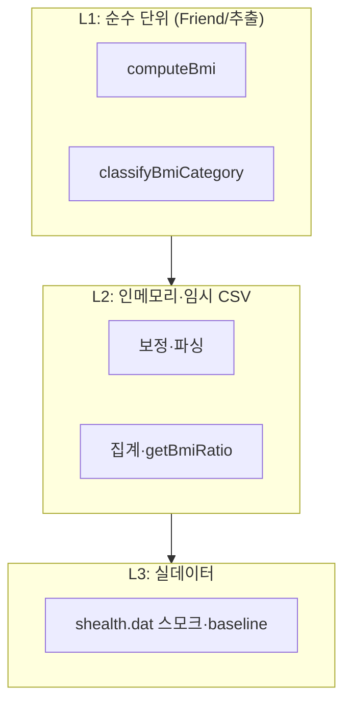

# SHealth BMI — 테스트 계획서

| 항목 | 내용 |
|------|------|
| 문서 목적 | 1차 리팩토링(3단계) 완료 후 코드 구조에 맞춘 TDD·단위·통합 테스트 전략 (**5단계** 구현 입력) |
| 대상 독자 | C++ QA·TDD 구현 담당자 |
| 기준 문서 | `README.md`, `docs/requirements_analysis.md`, `docs/code_quality_report.md`, `docs/refactor_baseline_output.txt` |
| 분석 대상 | `src/main/cpp/SHealth.h`, `SHealth.cpp`, `src/test/cpp/SHealthBMITest.cpp` |
| 워크플로우 단계 | **4단계** (테스트 계획) → **5단계** TDD 구현 시 본 문서 기준 `ctest` Green (`prompt_리펙토링 우선 진행(수정).md`) |
| 코드 변경 | 없음 (본 단계 산출물) |

---

## 1. 배경 및 전제

### 1.1 1차 리팩토링 후 테스트 대상 구조

3단계 이후 `SHealth`는 단일 God Method에서 **오케스트레이션 + 단계별 private 메서드**로 분리되었다.

| 구분 | 심볼 | 접근 | 역할 |
|------|------|------|------|
| Public | `calculateBmi(filename)` | public | CSV 로드 → 보정 → BMI → 연령대 비율 집계 |
| Public | `getBmiRatio(ageClass, type)` | public | `cohortRatios_[cohort][category]` 조회 |
| Public | `BmiCategoryType` | enum class | type 코드 100/200/300/400 |
| Private | `loadFromCsv` | private | 파일 I/O·파싱 |
| Private | `imputeMissingWeights` | private | 체중 0 → 연령대 평균 |
| Private | `computeAllBmi` | private | 레코드별 BMI |
| Private | `computeAgeCohortRatios` | private | 연령대×4범주 % |
| Private static | `computeBmi`, `classifyBmiCategory`, `isInAgeCohort` | private | 순수 도메인 로직 |
| Private static | `ageClassToCohortIndex`, `typeToCategoryIndex` | private | API·저장 인덱스 매핑 |

**의도적 미수정(6~7단계·결함 목록 대상)** — 5단계 TDD에서 일부는 최소 수정됨 — 현행 코드 그대로 TC에 반영·수정 후 Green:

- BMI **= 25.0** 미분류 (`classifyBmiCategory` → `-1`, 집계 제외)
- 연령대 **전원 weight=0** → `ageCount==0` 시 0 나누기
- 연령대 **무인원** → `sum==0` 시 0 나누기
- **height=0** 보정 미구현 → BMI 무한대 위험
- `calculateBmi` 실패 시 `cohortRatios_` 잔존 가능

### 1.2 테스트 범위(In / Out)

| 구분 | 포함 | 제외 |
|------|------|------|
| In | `shealth_lib` 도메인·집계·`getBmiRatio` 계약 | UI·네트워크 |
| In (5단계) | P0~P3 단위·픽스처 통합 TC | |
| In (7단계 후) | Activities 4 — height 보정, 정상 목록, 전체 비율 API | 5단계 초안 TC만 예약 |
| Out (5단계) | `SHealthBMI.cpp` main 출력 포맷 자체 | Golden은 9단계 |
| Out | `count ≥ kMaxRecords` 오버플로우 | 별도 성능·안정성 과제 |

### 1.3 완료 조건 (5단계)

1. `docs/test_plan.md`의 **P0 → P1 → P2 → P3** 순으로 실패 테스트 작성 후 Green.
2. `cmake --build build && ctest` **전체 통과**.
3. `SHealthBMITest.cpp`의 `FailedTest` 플레이스홀더 제거.
4. (6단계 완료 후) §12 결함 재발 TC 매핑 반영.

---

## 2. TDD 4영역 우선순위 (P0 / P1 / P2 / P3)

4개 영역에 **구현·디버깅 순서**를 부여한다. (문서상 P0~P3; 상위 3단계만 강조할 때는 P0→P1→P2를 먼저 Green, P3·통합는 직후.)

| 우선순위 | 영역 | 대상 로직 | 주요 검증 포인트 | 5단계 TC 수(목표) |
|----------|------|-----------|------------------|-------------------|
| **P0** | BMI 계산 | `computeBmi` (간접·직접) | kg·cm→m², 소수·표준 샘플, 극단값 | 5~8 |
| **P1** | 연령대 평균 보정 | `imputeMissingWeights` (+7단계 `height`) | weight=0, height=0, 전원 0, 연령대 격리 | 8~12 |
| **P2** | BMI 4단계 분류 | `classifyBmiCategory` | 18.5, 23, 25 경계, README 기준 | 10~14 |
| **P3** | 연령대 통계·조회 | `isInAgeCohort`, `computeAgeCohortRatios`, `getBmiRatio` | 19/20/29/30, 비율 합≈100%, 잘못된 인자 | 12~16 |

### 2.1 P0 — BMI 계산 로직

| ID | 시나리오 | Given | When | Then |
|----|----------|-------|------|------|
| TP-P0-01 | 표준 BMI | 70 kg, 170 cm | `computeBmi` | ≈ 24.221453 (`ε=1e-5`) |
| TP-P0-02 | cm→m 변환 | 80 kg, 180 cm | 계산 | `80 / 1.8²` |
| TP-P0-03 | README 유사 소수 | 79.5 kg, 158.3 cm | 계산 | 이론값 `EXPECT_NEAR` |
| TP-P0-04 | 저체중 구간 BMI | 50 kg, 170 cm | 계산 | ≈ 17.30 |
| TP-P0-05 | 극단 키 | 50 kg, 200 cm | 계산 | 유한 양수 |
| TP-P0-06 | 키 0 (미보정) | weight>0, height=0 | `calculateBmi` 픽스처 | inf/NaN 또는 **7단계** height 보정 후 유한값 (§6.2) |

**TDD 메모:** `computeBmi`가 `private static`이므로 5단계 시작 시 **아래 §4.1 방식 A 또는 B** 중 하나를 선택한다.

### 2.2 P1 — 연령대 평균 보정 (weight=0, height=0)

| ID | 시나리오 | Given | When | Then |
|----|----------|-------|------|------|
| TP-P1-01 | 단일 0 보정 | 20대: 60 kg, 0 kg | `calculateBmi` | 0 레코드 체중 → 60 |
| TP-P1-02 | 다중 유효 평균 | 30대: 80, 100, 0 | 보정 | 0 → 90 |
| TP-P1-03 | 연령대 격리 | 20대 0 / 30대 70만 유효 | 보정 | 20대 평균에 30대 미포함 |
| TP-P1-04 | 전원 weight=0 | 한 연령대 모두 0 | 보정 | **5단계:** ageCount=0 스킵 (§6.3) |
| TP-P1-05 | 연령대 외 0 | age=19, weight=0 | 보정 | 20대 평균 미적용 |
| TP-P1-06 | 실데이터 스모크 | `shealth.dat` 내 `93730,57,0,...` | `calculateBmi` | 크래시 없음, BMI 유한 |
| TP-P1-07 | height=0 보정 (7단계) | 40대 170, 0 | F-03 구현 후 | 0 → 170 |
| TP-P1-08 | 전원 height=0 (7단계) | 한 연령대 height 전부 0 | F-03 | 0 나누기·BMI 방어 |

**보정 순서(7단계 설계 시):** 체중 보정 → 키 보정 → BMI (README 대칭). **5단계 TDD**는 **weight만** Green 가능, height TC는 `DISABLED_` 또는 `GTEST_SKIP`으로 예약.

### 2.3 P2 — BMI 카테고리 분류

**확정 기준:** `docs/requirements_analysis.md` §3.4 (README 우선).

```
BMI ≤ 18.5           → 저체중 (index 0)
18.5 < BMI < 23      → 정상   (index 1)
23 ≤ BMI < 25        → 과체중 (index 2)
BMI ≥ 25             → 비만   (index 3)
```

| ID | BMI 입력 | 기대 분류 | 비고 |
|----|----------|-----------|------|
| TP-P2-01 | 17.0 | 저체중 | 내부값 |
| TP-P2-02 | **18.5** | 저체중 | README·현행 코드 일치 |
| TP-P2-03 | 18.500001 | 정상 | 정상 하한 |
| TP-P2-04 | 22.999 | 정상 | 정상 상한 |
| TP-P2-05 | **23.0** | 과체중 | |
| TP-P2-06 | 24.999 | 과체중 | |
| TP-P2-07 | **25.0** | 비만 | **5단계 TDD에서 Green** (DEF 회귀) |
| TP-P2-08 | 30.0 | 비만 | |
| TP-P2-09 | 18.5 (png 논쟁) | 저체중 | TC-38 회귀, 요구 확정 유지 |

### 2.4 P3 — 연령대별 BMI 통계·`getBmiRatio`

| ID | 시나리오 | Given | When | Then |
|----|----------|-------|------|------|
| TP-P3-01 | 20대 하한 | age=20 | `isInAgeCohort(20,20)` | true |
| TP-P3-02 | 20대 상한 | age=29 | 20대 | true |
| TP-P3-03 | 30대 하한 | age=30 | 20대 | false / 30대 true |
| TP-P3-04 | 19세 | age=19 | 20대 집계 | 미포함 |
| TP-P3-05 | 70대 | age=79 | 70대 | true |
| TP-P3-06 | 4분류 25%×4 | 20대 4명 각 범주 1명 픽스처 | `getBmiRatio` ×4 | 각 25%, 합 ≈ 100 |
| TP-P3-07 | type 100 | 저체중 2/10 | `getBmiRatio(20,100)` | 20.0 |
| TP-P3-08 | 잘못된 type | type=999 | 조회 | 0.0 |
| TP-P3-09 | 잘못된 ageClass | ageClass=25 | 조회 | 0.0 |
| TP-P3-10 | sum=0 연령대 | 20대 0명 픽스처 | 20대 4 type | 0 나누기 없음 (§6.3) |
| TP-P3-11 | BMI=25 집계 | 25.0 1명 포함 픽스처 | 비율 합 | 4범주 합 = 인원 (수정 후) |
| TP-P3-12 | baseline 회귀 | `shealth.dat` | 6연령×4 | `docs/refactor_baseline_output.txt`와 `EXPECT_NEAR` |
| TP-P3-13 | 이중 calculateBmi | 동일 파일 2회 | 두 번째 | 첫 결과와 동일 |
| TP-P3-14 | calculateBmi 미호출 | — | `getBmiRatio`만 | 0.0 (또는 문서화된 미정의 — TC로 고정) |

---

## 3. 테스트 접근 전략 (리팩토링 후 구조)

### 3.1 Private 로직 검증 방식

| 방식 | 설명 | 권장 |
|------|------|------|
| **A. Friend 테스트 피어** | `SHealth.h`에 `friend class SHealthTestPeer;` — gtest에서 `computeBmi`/`classifyBmiCategory` 직접 호출 | **P0·P2에 권장** (최소 침습) |
| **B. 픽스처 통합** | 소형 CSV + `calculateBmi` → BMI·비율 역산 검증 | P1·P3·파일 오류 |
| **C. 도메인 추출 (5~6단계)** | `shealth::BmiCalculator` 등 헤더 분리 후 public 테스트 | 장기·F-01 정합 |

5단계 **1주차:** A로 P0/P2 Green → B로 P1/P3 Green.

### 3.2 테스트 파일 구조 (권장)

```
src/test/cpp/
  SHealthBMITest.cpp          # TEST / TEST_F 진입
  fixtures/
    minimal_underweight.csv
    cohort_20_four_categories.csv
    weight_zero_single.csv
    ...
```

- **단일 조건 per TEST** — 하나의 `TEST`는 하나의 `EXPECT_*` 주장군(동일 개념)만.
- **Given-When-Then** — 각 테스트 상단 한글 주석 3줄.
- **네이밍:** `SHealthBMITest.<Area>_<Condition>_<Expected>`  
  예: `ComputeBmi_StandardWeightHeight_ReturnsNear2422`

### 3.3 부동소수점 규약

| 용도 | 매크로 | ε |
|------|--------|---|
| BMI 값 | `EXPECT_NEAR(actual, expected, 1e-5)` | `1e-5` |
| 비율(%) | `EXPECT_NEAR(actual, expected, 1e-3)` | `0.001` (% 단위) |
| 비율 합 100 | `EXPECT_NEAR(sum, 100.0, 0.01)` | `0.01` |
| 정수 count | `EXPECT_EQ` | — |

---

## 4. README Activities 4 — 기능 개선별 테스트 범위 초안

워크플로우 **7단계(기능 개선)** 구현 후 **5단계 TC 보강** 또는 `GTEST_SKIP` 해제로 연결한다.

| README 항목 | 요구 ID | 구현 단계 | 5단계 TC 범위 (초안) | 우선순위 |
|-------------|---------|-----------|----------------------|----------|
| SRP·책임 분리 | F-01 | 5~6 | 기존 P0~P3 TC가 깨지지 않음(회귀); 모듈 분리 후 동일 시나리오 ID 유지 | 회귀 |
| 연령대 BMI 분포 비율 | F-02 | 3(완료) | TP-P3-06~12, baseline | P3 |
| Height 0 평균 보정 | F-03 | 5 | TP-P1-07~08, TP-P0-06 해제 | P1 |
| 정상 BMI 사용자 목록 | F-04 | 5 | **TP-F04-01** 혼합 ID → 정상만; **TP-F04-02** 전원 비만 → 빈 목록; **TP-F04-03** 경계 18.5/23 제외 | P2 연계 |
| 전체 사용자 범주 비율 | F-05 | 5 | **TP-F05-01** 100명 고정 분포 → 4비율 합≈100; **TP-F05-02** `count=0` → 0% | P3 연계 |

### 4.1 F-04 / F-05 상세 (API 확정 후 테스트명 고정)

| ID | Given | When | Then |
|----|-------|------|------|
| TP-F04-01 | ID 1(정상), 2(저체중), 3(정상) | `listNormalBmiUsers()` (가칭) | {1,3} |
| TP-F04-02 | 전원 BMI≥25 | 동일 API | 빈 컨테이너 |
| TP-F04-03 | BMI=18.5, 23.0 경계 | 동일 API | README 기준 정상만 (18.5 제외, 23 미만) |
| TP-F05-01 | 10 저체중 / 40 정상 / 20 과체중 / 30 비만 | `getOverallBmiRatio(type)` | 10/40/20/30 % |
| TP-F05-02 | 헤더만 CSV | 전체 비율 | 0.0, 크래시 없음 |

---

## 5. 경계값 매트릭스

### 5.1 BMI 분류 경계

| BMI 값 | README 분류 | `bmi.png` | **테스트 기대 (확정)** | 현행 `classifyBmiCategory` | TC ID |
|--------|-------------|-----------|------------------------|----------------------------|-------|
| 18.499 | 저체중 | 저체중 | 저체중 | 저체중 | TP-P2-01 |
| **18.5** | 저체중 | 정상 | **저체중** | 저체중 | TP-P2-02 |
| 18.500001 | 정상 | 정상 | 정상 | 정상 | TP-P2-03 |
| 22.999 | 정상 | 정상 | 정상 | 정상 | TP-P2-04 |
| **23.0** | 과체중 | 과체중 | **과체중** | 과체중 | TP-P2-05 |
| 24.999 | 과체중 | 과체중 | 과체중 | 과체중 | TP-P2-06 |
| **25.0** | 비만 | 비만 | **비만** | **-1 (결함)** | TP-P2-07 |
| 25.000001 | 비만 | 비만 | 비만 | 비만 | TP-P2-08 |

### 5.2 연령 구간 경계

| age | 20대 [20,30) | 30대 [30,40) | 집계 포함 | TC ID |
|-----|--------------|--------------|-----------|-------|
| 19 | ✗ | ✗ | 없음 | TP-P3-04 |
| 20 | ✓ | ✗ | 20대 | TP-P3-01 |
| 29 | ✓ | ✗ | 20대 | TP-P3-02 |
| 30 | ✗ | ✓ | 30대 | TP-P3-03 |
| 79 | — | — | 70대 | TP-P3-05 |

### 5.3 파일·CSV 경계

| 조건 | 입력 | 기대 `calculateBmi` | 기대 부작용 | TC ID |
|------|------|---------------------|-------------|-------|
| 정상 파일 | 유효 CSV | `count > 0` | 비율 유한 | TP-P3-12 |
| **파일 미존재** | `no_such.dat` | **0** | stderr 메시지, 크래시 없음 | TP-P3-15 |
| **빈 파일** | 0 byte | 0 | 안전 | TP-P3-16 |
| **헤더만** | 1행 | 0 | sum=0 연령대 안전 | TP-P3-10 |
| **잘못된 CSV** | `abc,xx,yy,zz` | 예외 또는 0 (정책 확정 후 TC) | `stoi` 예외 — 4단계에서 catch 정책 | TP-P3-17 |
| 첫 줄 빈 줄 | 헤더 후 `\n\n` | **현행:** 이후 데이터 무시 가능 | B-08 | TP-P3-18 |
| 쉼표만/열 부족 | `1,2,3` | 파싱 실패 정책 | 결함 목록 | TP-P3-19 |

---

## 6. 예외·특이 케이스

| ID | 상황 | 현행 동작 | 테스트 기대 (6단계 후) | 우선순위 |
|----|------|-----------|------------------------|----------|
| EX-01 | 연령대 **sum=0** | `0/0` → NaN 비율 | 0.0% 또는 집계 스킵 | P3 |
| EX-02 | 연령대 **전원 weight=0** | `sum/ageCount`, ageCount=0 | 보정 스킵·0 유지·크래시 없음 | P1 |
| EX-03 | **height=0** (미보정) | BMI inf | F-03 후 유한 BMI | P1 |
| EX-04 | **BMI=25** 미분류 | category=-1, 비율 합 < 100% | 비만 분류, R-01 만족 | P2 |
| EX-05 | **파일 미존재** | return 0 | 동일 + `getBmiRatio` 안전 | P3 |
| EX-06 | `calculateBmi` 실패 후 조회 | 이전 `cohortRatios_` 잔존 가능 | 실패 시 비율 0 초기화 (결함 수정 시) | P3 |
| EX-07 | 잘못된 `getBmiRatio` | 0.0 | 오류 vs 0% — **문서화된 0.0 유지** | P3 |
| EX-08 | `count` 상한 초과 | 버퍼 오버플로우 | 6단계: 거부 또는 cap (TC 예약) | Out |

### 6.1 일관성 요구 (R-01~R-03)

| 요구 | 검증 TC |
|------|---------|
| R-01 한 연령대 4범주 인원 합 = sum | TP-P3-06, TP-P3-11 |
| R-02 4비율 합 ≈ 100% | TP-P3-06, TP-F05-01 |
| R-03 sum=0 시 0 나누기 없음 | TP-P3-10, EX-01 |

---

## 7. Fake / Fixture 데이터 전략

### 7.1 계층



### 7.2 픽스처 유형

| 유형 | 구현 | 용도 | 예시 |
|------|------|------|------|
| **인메모리 문자열** | `std::istringstream` + `loadFromCsv` 래핑(7단계) 또는 임시 파일 | P0 역산용 최소 레코드 | 한 줄 CSV |
| **저장 픽스처** | `src/test/fixtures/*.csv` | 반복 TC, 코드리뷰 용이 | `cohort20_equal4.csv` |
| **런타임 임시 파일** | `std::tmpfile` / `build/test_tmp/*.dat` | 파일 오류·권한 | `empty.dat`, `bad_parse.dat` |
| **프로젝트 실데이터** | `shealth.dat` (CMake `WORKING_DIRECTORY`) | TP-P1-06, TP-P3-12 | 회귀·스모크 |

### 7.3 표준 픽스처 카탈로그 (5단계 생성 권장)

| 파일명 | 레코드 요약 | 검증 영역 |
|--------|-------------|-----------|
| `bmi_standard_70_170.csv` | 1명 25세 70/170 | P0 |
| `weight0_single_20s.csv` | 20대 60 + 0 | P1 |
| `weight0_all_zero_30s.csv` | 30대 전원 0 | EX-02 |
| `cohort20_four_categories.csv` | 20대 4명 각 범주 | P2, P3 |
| `age_boundary.csv` | 19,20,29,30 | P3 |
| `header_only.csv` | 헤더 1행 | EX-01, TP-P3-10 |
| `bmi25_one.csv` | BMI 정확히 25 | TP-P2-07, EX-04 |

**헤더 형식 (공통):**

```csv
id,age,weight,height
```

### 7.4 TEST_F 픽스처 클래스 (권장)

```cpp
class SHealthFixture : public ::testing::Test {
protected:
    void SetUp() override { health_ = std::make_unique<SHealth>(); }
    int LoadFixture(const std::string& relPath);  // build dir 기준
    std::unique_ptr<SHealth> health_;
};
```

- CMake: `target_compile_definitions(SHealthBMITest PRIVATE SHEALTH_FIXTURE_DIR=\"${CMAKE_SOURCE_DIR}/src/test/fixtures\")`
- 또는 `configure_file`로 `test_paths.h` 생성.

---

## 8. 커버리지 목표 (90%+) 및 측정·개선 절차

### 8.1 목표

| 대상 | 라인 커버리지 | 분기 커버리지 | 비고 |
|------|---------------|---------------|------|
| `SHealth.cpp` | **≥ 90%** | **≥ 85%** | 5단계 완료 시 |
| `SHealth.h` (inline 없음) | — | — | 선언만 |
| **제외** | `SHealthBMI.cpp`, gtest, FetchContent | | |

### 8.2 측정 절차 (GCC/MinGW 예시)

1. **CMake 옵션 추가 (5단계)**

```cmake
option(SHEALTH_COVERAGE "Enable coverage" OFF)
if(SHEALTH_COVERAGE)
  target_compile_options(shealth_lib PRIVATE --coverage -O0 -g)
  target_link_options(shealth_lib PRIVATE --coverage)
endif()
```

2. **빌드·실행**

```bash
cmake -B build -DSHEALTH_COVERAGE=ON
cmake --build build
cd build && ctest
```

3. **리포트**

```bash
gcov -o build/CMakeFiles/shealth_lib.dir/src/main/cpp build/*.gcda
lcov --capture --directory build --output-file coverage.info
lcov --remove coverage.info '/usr/*' '*gtest*' --output-file coverage.filtered.info
genhtml coverage.filtered.info --output-directory build/coverage_html
```

4. **미커버 라인** — `build/coverage_html`에서 `classifyBmiCategory` default `-1`, `loadFromCsv` 실패 분기, `typeToCategoryIndex` default 등을 P2/P3 TC로 보강.

### 8.3 개선 사이클

| 단계 | 활동 |
|------|------|
| 1 | 5단계 P0 Green 후 1차 커버리지 측정 (baseline %) |
| 2 | 90% 미만 파일·함수 목록화 (`lcov --list`) |
| 3 | 미커버 분기 = §5 매트릭스·§6 예외와 매핑해 TC 추가 |
| 4 | 6단계 결함 수정 TC(§12) 반영 후 재측정 |
| 5 | 9단계 Golden Master 추가 시 **통합 스모크 1건** 유지, 커버리지 하락 방지 |

---

## 9. 5단계 TDD 실행 순서 (체크리스트)

| 순서 | 작업 | 산출 |
|------|------|------|
| 1 | `FailedTest` 제거, `SHealthFixture`·Friend(또는 B만) 결정 | 빌드 Green 0 tests → scaffold |
| 2 | **P0** Red → Green (`TP-P0-01`~`05`) | |
| 3 | **P2** 경계 Red → Green; `TP-P2-07` BMI=25 | |
| 4 | **P1** 픽스처 Red → Green | |
| 5 | **P3** 집계·API·파일 Red → Green | |
| 6 | `shealth.dat` baseline `TP-P3-12` | |
| 7 | 커버리지 90% 확인·갭 TC | |
| 8 | (6단계 후) §12 DEF-xxx 회귀 TC 추가 | |

---

## 10. Golden Master·회귀 (9단계 연계)

| 항목 | 내용 |
|------|------|
| 기준 파일 | `docs/refactor_baseline_output.txt` (6연령×4비율) |
| 5단계 | `TP-P3-12`로 수치 회귀 자동화 |
| 9단계 | `SHealthBMI` stdout 전체 diff 또는 허용 오차 파일 비교 |
| 결함 수정 후 | baseline **갱신** + PR에 diff 사유 기록 |

---

## 11. 요구사항 문서 TC 매핑

`docs/requirements_analysis.md` §8 시나리오와 본 계획 ID 대응.

| 요구 TC | 본 계획 ID |
|---------|------------|
| TC-01~03 | TP-P0-01~03 |
| TC-04~11 | TP-P2-01~08 |
| TC-12~16 | TP-P3-01~05 |
| TC-17~20 | TP-P1-01~04 |
| TC-21~22 | TP-P1-07~08, TP-P0-06 |
| TC-23~27 | TP-P3-06~09 |
| TC-28~30 | TP-P3-15~10 |
| TC-31 | TP-P2-07, TP-P3-11 |
| TC-32~34 | TP-F04-01~02, TP-F05-01 |
| TC-35~40 | TP-P3-12~14, TP-P1-03, TP-P3-12 |

---

## 12. [예약] `docs/defect_list.md` 결함 재발 방지 TC 매핑

> **6단계(결함 분석) 완료 후** `defect_list.md`의 `DEF-xxx` 항목을 아래 표에 채운다. 5단계 마무리 전 최소 1회 동기화.

| DEF-ID | 결함 요약 | 코드 근거 | 재발 방지 TC | 우선순위 | 상태 |
|--------|-----------|-----------|--------------|----------|------|
| DEF-___ | BMI=25 미분류 | `classifyBmiCategory` L44 `> 25` | **TP-P2-07**, **TP-P3-11**, **EX-04** | P2 | 예약 |
| DEF-___ | sum=0 0 나누기 | `computeAgeCohortRatios` L125 | **TP-P3-10**, **EX-01** | P3 | 예약 |
| DEF-___ | 전원 weight=0 | `imputeMissingWeights` L96 | **TP-P1-04**, **EX-02** | P1 | 예약 |
| DEF-___ | height=0 | `computeBmi` | **TP-P0-06**, **EX-03** | P1 | 예약 |
| DEF-___ | 빈 줄 조기 break | `loadFromCsv` L66-68 | **TP-P3-18** | P3 | 예약 |
| DEF-___ | calculateBmi 실패 잔존 상태 | `calculateBmi` | **EX-06** | P3 | 예약 |
| DEF-___ | count 상한 미검사 | `loadFromCsv` L72 | (TC 예약) | Out | 예약 |

**동기화 절차**

1. **6단계**에서 `docs/defect_list.md` 작성 (`DEF-001` 형식).
2. 각 DEF에 본 표 **재발 방지 TC** 열을 링크.
3. 결함 수정 PR = 해당 TC Red → Green + baseline 갱신 여부 명시.

---

## 13. 부록 — 현행 API 계약 (테스트 Oracles)

### 13.1 `calculateBmi`

| 결과 | 의미 |
|------|------|
| `> 0` | 로드 레코드 수 `count` |
| `0` | 파일 열기 실패 또는 0건 |

### 13.2 `getBmiRatio(ageClass, type)`

| `ageClass` | `type` | 반환 |
|------------|--------|------|
| 20,30,…,70 | 100,200,300,400 | 해당 % |
| 그 외 | | `0.0` |

### 13.3 상수 (1차 리팩토링)

`kBmiUnderweightMax=18.5`, `kBmiNormalUpperExclusive=23`, `kBmiOverweightMin=23`, `kBmiOverweightMaxExclusive=25`, `kBmiObesityMinExclusive=25` — **5단계 TDD에서 비만 하한 `>= 25` 정합 완료.**

---

*문서 버전: 1.1 | 워크플로우 **4단계** | 다음: **5단계** TDD Green | 후속: `defect_list.md`(6단계), `refactoring_plan.md`(5단계) — 기준: `prompt_리펙토링 우선 진행(수정).md`*
