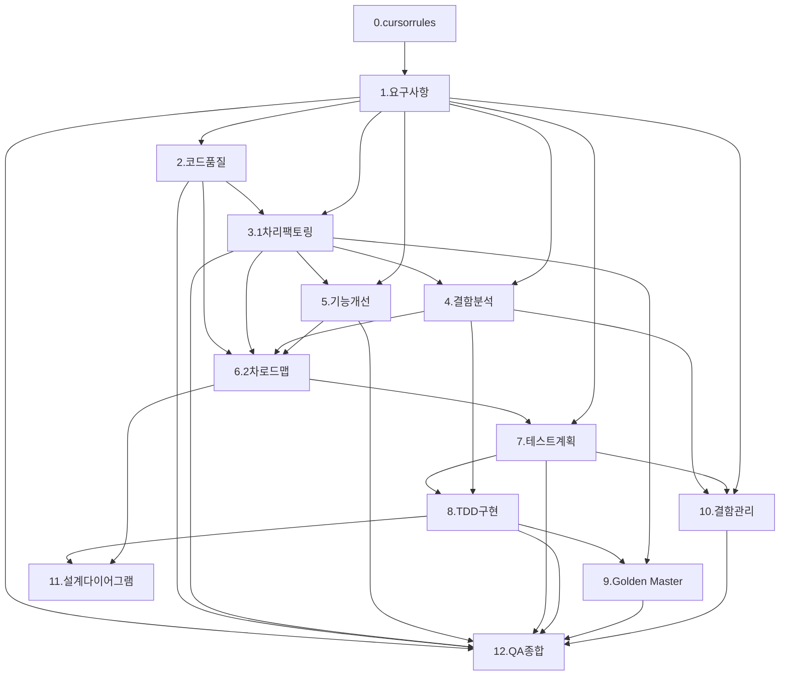

# SHealth BMI 프로젝트 — 리팩토링 우선 프롬프트 (2026-05-20)

> 원본: `prompt_테스트 우선 진행.md`  
> 목적: **리팩토링·구조 개선을 먼저** 수행하고, **테스트 계획·TDD·Golden Master는 후반(7~9단계)**에 집중하는 워크플로우

---

## 사용 방법

1. **공통 컨텍스트**를 먼저 읽고, 해당 단계 프롬프트를 그대로 복사해 사용한다.
2. 단계는 **의존 순서**를 따른다 (이전 단계 산출물 `@` 참조).
3. **0~6단계**(리팩토링·기능 개선): `cmake --build build` 성공 + (가능하면) `SHealthBMI` 수동 실행으로 동작 확인. `ctest` Green은 **8단계 이후** 완료 조건.
4. **7~12단계**(테스트·QA): `cmake --build build && ctest` Green을 완료 조건으로 둔다.
5. 세션 종료 시 **후처리 프롬프트**를 한 번 실행한다.

---

## 공통 컨텍스트 (모든 단계에 적용)

| 항목 | 내용 |
|------|------|
| 프로젝트 | SHealth BMI — C++17, CMake 3.10+, Google Test (FetchContent 자동 다운로드) |
| 워크플로우 | **리팩토링 우선** — 코드 품질·구조 개선 → 기능 확장 → (후반) 테스트 계획·TDD |
| 도메인 | CSV(`shealth.dat`)에서 ID·나이·체중(kg)·키(cm) 로드 → BMI 계산 → 연령대별 체중 분포 통계 |
| BMI 공식 | `체중(kg) / (키(m))²` — 키는 cm 입력, 계산 시 `/100.0` 변환 |
| BMI 분류 | ≤18.5 저체중 · 18.5 초과 23 미만 정상 · 23 이상 25 미만 과체중 · 25 이상 비만 |
| 연령대 | 20·30·40·50·60·70대 — 각 `[a, a+10)` 구간 (예: 20대 = 20≤나이<30) |
| 누락 보정 | 체중 `0.0` → 동일 연령대 유효 체중 평균으로 대체 (README 기준) |
| API 관례 | `getBmiRatio(ageClass, type)` — ageClass: 20/30/…/70, type: 100=저체중·200=정상·300=과체중·400=비만 |
| 테스트 (후반) | Given-When-Then · `TEST`/`TEST_F` · 경계값(18.5, 23, 25, 연령 경계 20/30/…) 필수 |
| 리팩토링 | 동작 변경 최소화 · 매직 넘버 상수화 · 함수·클래스 분리 — **8단계 Green 이후** 추가 리팩토링 시 테스트 유지 |
| 검증 명령 | `mkdir build && cd build && cmake .. && cmake --build .` · 8단계~: `&& ctest` |
| 산출물 언어 | 설명·문서는 **한글**, 코드·식별자는 기존 프로젝트 규칙 준수 |

**프롬프트 구조:** `[P]` 역할 · `[C]` 맥락 · `[T]` 작업 · `[F]` 산출물 형식

**주요 소스 경로**

| 역할 | 경로 |
|------|------|
| 헤더 | `src/main/cpp/SHealth.h` |
| 구현 | `src/main/cpp/SHealth.cpp` |
| 실행 진입점 | `src/main/cpp/SHealthBMI.cpp` |
| 단위 테스트 | `src/test/cpp/SHealthBMITest.cpp` |
| 샘플 데이터 | `shealth.dat` |
| 빌드 | `CMakeLists.txt` |

---

## 단계별 프롬프트

### 0. 프로젝트 규칙 (.cursorrules)

```
[P] 레거시 C++ QA/리팩토링 시니어 엔지니어
[C] SHealth BMI C++17 프로젝트 — **리팩토링 우선** 워크플로우용 Cursor 규칙
[T] 프로젝트 루트 `.cursorrules` 작성
    - 기술 스택: C++17, CMake, Google Test, shealth_lib
    - 도메인: BMI 공식, 4단계 분류 기준, 연령대 구간, 체중 0 평균 보정
    - 워크플로우: 분석 → 1차 리팩토링 → 결함·기능 → 2차 로드맵 → (후반) 테스트 계획·TDD
    - 리팩토링: 매직 넘버 상수화, SRP·함수 추출, 최소 변경, 동작 보존
    - 테스트: 7~8단계에서 집중 — Given-When-Then, 경계값, 단일 조건 per TEST
    - README Activities 1~5 순서를 **리팩토링 우선** 관점으로 재해석
[F] `.cursorrules`에 완성 텍스트 붙여넣기하여 파일 생성 (한글 설명)
```

**완료 기준:** `.cursorrules` 파일 생성

---

### 1. 요구사항 분석

```
@README.md @bmi.png

[P] 시니어 C++ QA 엔지니어
[C] SHealth BMI C++17 (CMake, Google Test) — README 기반 도메인 요구사항
[T] C++ 구현·리팩토링·(후반) 테스트 관점으로 요구사항 재정리
    1) 기본 원칙 및 범위 (삼성 헬스 연령대별 BMI 통계)
    2) 입력 데이터 형식 (shealth.dat CSV) — 표
    3) BMI 계산 및 4단계 분류 기준 — 표
    4) 체중 누락(0) 연령대 평균 보정 — 표
    5) 연령대별 저체중/정상/과체중/비만 비율 산출 — 표
    6) getBmiRatio(ageClass, type) API 계약 — 표
    7) README Activities 4 기능 개선 항목 (SRP 분리, 키 0 보정, 정상 BMI 목록, 전체 비율 등)
    8) (후반 8단계용) Google Test 시나리오 번호 목록 (30건 이상 권장)
[F] Markdown(표+번호 목록) → docs/requirements_analysis.md 저장
```

**완료 기준:** `docs/requirements_analysis.md` 생성 (코드 변경 없음)

---

### 2. 코드 품질 분석

```
@src/main/cpp/SHealth.h @src/main/cpp/SHealth.cpp @src/main/cpp/SHealthBMI.cpp
@docs/requirements_analysis.md

[P] 시니어 C++ 아키텍트 + 모던 C++ 리뷰어
[C] SHealth 클래스 — SOLID·Code Smell 관점 정적 분석 (현재 레거시 구현)
[T] SHealth 클래스 품질 분석
    - SRP/OCP/LSP/ISP/DIP 위반 여부
    - Magic Number (18.5, 23, 25, 100/200/300/400, 고정 배열 10000)
    - 중복 분기 (연령대별 if-else, getBmiRatio 스위치)
    - 데이터 로딩·보정·BMI 계산·통계 집계의 결합도
    - 경계값 버그 후보 (BMI=18.5/23/25, sum=0, ageCount=0)
    - 3단계 1차 리팩토링·6단계 2차 로드맵을 위한 우선순위 1~5 (근거 포함)
[F] Markdown 표 → docs/code_quality_report.md 저장
```

**완료 기준:** `docs/code_quality_report.md` 생성

---

### 3. 1차 리팩토링 (클린코드)

```
@src/main/cpp/SHealth.h @src/main/cpp/SHealth.cpp @src/main/cpp/SHealthBMI.cpp
@docs/code_quality_report.md @docs/requirements_analysis.md

[P] 모던 C++ 리팩토링 코치
[C] README Activities 2 (클린코드 1차) — **테스트 미작성 상태**, 동작 보존 리팩토링
[T] 동작 변경 없이 리팩토링
    - 네이밍 개선 (underweight20 등 → 구조체/맵/enum)
    - 하드코드·매직 넘버 상수화 (18.5, 23, 25, 100/200/300/400)
    - 함수 추출 (CSV 파싱, 보정, BMI 계산, 연령대 통계)
    - 반복/중복 제거 (연령대별 if-else, getBmiRatio 분기)
    - 검증: cmake --build build 성공 + ./SHealthBMI 출력이 리팩토링 전과 동일한지 확인
      (또는 docs/refactor_baseline_output.txt에 기준 출력 저장)
[F] 리팩토링 diff + 빌드 성공 + (권장) 기준 출력 문서 또는 수동 비교 기록
```

**완료 기준:** 빌드 성공 + 동작 보존 확인 (ctest는 아직 필수 아님)

**클린코드 전용 프롬프트**

```
현재 SHealth C++ 코드를 클린코드 원칙(SRP, DRY, 의미 있는 네이밍, 함수 분리)에 따라 리팩토링해줘.
특히 Magic Number 제거, 한 함수의 책임 최소화, 테스트하기 쉬운 분리에 주의해줘.
동작은 README 요구사항과 동일하게 유지하고, 빌드 후 SHealthBMI 출력으로 검증해줘.
```

---

### 4. 결함 분석·문서화

```
@src/main/cpp/SHealth.h @src/main/cpp/SHealth.cpp @shealth.dat
@docs/requirements_analysis.md

[P] C++ QA 엔지니어 (디버깅·결함 분석)
[C] README BMI 기준 vs 3단계 리팩토링 후 구현 — 정적 분석·수동 실행 기준
[T]
    A) 요구사항 불일치·경계값 분석 (ctest 없이 코드 리뷰·SHealthBMI 출력)
       - BMI 18.5/23/25 경계, 연령 구간, 0 나눗셈
       - 버그 위치, 심각도, 최소 수정안
    B) 결함 목록 문서화
       - ID, Severity, ItemType, Steps, Expected, Actual, Root Cause, Fix Summary
    C) 명확한 버그는 즉시 수정 후 빌드·수동 출력 재확인
[F]
    A) 수정 diff (해당 시) + 빌드·출력 확인
    B) docs/defect_list.md (DEF-001~ 형식)
```

**완료 기준:** `docs/defect_list.md` + 확인된 결함 수정 후 빌드·동작 확인

---

### 5. 기능 개선 (SRP·확장)

```
@src/main/cpp/SHealth.h @src/main/cpp/SHealth.cpp
@docs/requirements_analysis.md @docs/code_quality_report.md

[P] 시니어 C++ 개발자
[C] README Activities 4 — 리팩토링 후 기능 추가 (단위 테스트는 8단계에서 보강)
[T] 기능 구현 (SRP·확장)
    - SRP에 따른 책임 분리 (파서, 보정, 분류, 통계)
    - 특정 연령대 BMI 분포 비율 조회 API
    - Height=0 연령대 평균 보정 (weight=0과 대칭)
    - BMI 정상 범위 사용자 목록 조회
    - 전체 사용자 대비 각 BMI 범주 비율
    - 검증: 빌드 + SHealthBMI 또는 API 수동 호출
[F] 구현 diff + docs/feature_changelog.md (선택)
```

**완료 기준:** 신규 기능 구현 + 빌드·수동 검증

---

### 6. 리팩토링 로드맵 (2차·구조)

```
@docs/code_quality_report.md @docs/requirements_analysis.md
@docs/defect_list.md
@src/main/cpp/SHealth.h @src/main/cpp/SHealth.cpp

[P] 모던 C++ 리팩토링 코치
[C] 1차 리팩토링·기능 개선 후 코드 기준선 — **테스트 도입 전** 구조 로드맵
[T] SHealth 2차 구조 개선 로드맵
    - 고정 배열(10000) → STL 컨테이너
    - 연령대·분류 enum/struct 테이블 드리븐 설계
    - getBmiRatio 분기 → 맵 또는 계산 함수
    - Phase별: 목표 / 변경 파일 / 리스크 / 롤백 / 검증 명령
    - 각 Phase는 8단계 TDD Green 이후 실행할 항목과 당장 실행할 항목 구분
[F] docs/refactoring_plan.md (Phase 0~N 체크리스트)
```

**완료 기준:** 실행 가능한 Phase 로드맵 문서 (당장 코드 변경은 선택)

---

### 7. 테스트 계획

```
@src/main/cpp/SHealth.h @src/main/cpp/SHealth.cpp
@README.md @docs/requirements_analysis.md @docs/refactoring_plan.md

[P] 시니어 QA 리드
[C] **리팩토링·기능 개선 완료 후** 코드 구조에 맞춘 테스트 전략
[T] 테스트 계획서 작성
    - TDD 4영역 우선순위 (P0/P1/P2)
      1) BMI 계산 로직
      2) 연령대 평균 보정 (weight=0, height=0)
      3) BMI 카테고리 분류
      4) 연령대별 BMI 통계·getBmiRatio
    - 5단계에서 추가된 API·SRP 분리 컴포넌트별 테스트 범위
    - 경계값 매트릭스 (18.5, 23, 25, 연령 19/20/29/30, 빈 파일, 잘못된 CSV)
    - 예외·특이 케이스 (sum=0, 전원 체중 0, 파일 미존재)
    - Fake/Fixture 데이터 전략 (소형 in-memory CSV 또는 임시 파일)
    - docs/defect_list.md 결함 재발 방지 TC 매핑
    - 커버리지 목표(90%+) 및 측정·개선 절차
[F] docs/test_plan.md 저장
```

**완료 기준:** `docs/test_plan.md` 생성

---

### 8. 테스트 구현 (TDD)

```
@src/main/cpp/SHealth.h @src/main/cpp/SHealth.cpp
@src/test/cpp/SHealthBMITest.cpp @shealth.dat
@docs/requirements_analysis.md @docs/test_plan.md @docs/defect_list.md

[P] 테스트 설계에 강한 시니어 C++ QA
[C] C++17, Google Test — 리팩토링된 SHealth에 대한 **테스트 보강** (현재 FAIL() 플레이스홀더 교체)
[T] TDD Red → Green
    1) test_plan 기준 실패 테스트 작성 (단일 조건, 명확한 TEST 이름)
       - BMI 계산
       - weight=0 / height=0 평균 보정
       - 4단계 분류
       - 연령대별 비율·getBmiRatio
       - 5단계 신규 API
    2) 테스트 통과에 필요한 최소 수정만 SHealth에 추가
    3) Given-When-Then 주석, EXPECT_NEAR/EXPECT_DOUBLE_EQ 적절 사용
    4) defect_list 항목 회귀 TC 포함
[F] 완성 테스트 코드 + 구현 diff. cmake --build build && ctest Green
```

**완료 기준:** `ctest` 전체 Green (`SHealthBMITest` 포함)

**빠른 TDD 보강 (단일 프롬프트)**

```
리팩토링이 끝난 SHealth BMI 코드에 대해 테스트를 보강하고 싶어.
1. BMI 계산  2. 평균 보정(weight=0, height=0)  3. BMI 분류  4. 연령대 통계·getBmiRatio
docs/test_plan.md 기준으로 실패 테스트부터 작성한 뒤 Green까지 맞춰줘.
```

---

### 9. Golden Master / 회귀 테스트 (선택)

```
@src/main/cpp/SHealthBMI.cpp @shealth.dat
@src/test/cpp/SHealthBMITest.cpp @docs/refactor_baseline_output.txt

[P] Approval/Golden Master 회귀 테스트 설계 전문가
[C] 3단계에서 저장한 기준 출력 + 8단계 Green — SHealthBMI 연령대×4분류 비율
[T] Golden Master 체계 구현
    1) `SHealthBMI` 실행 기대 출력 캡처 (test/golden/shealth_bmi.approved.txt)
    2) Google Test로 계산 결과 vs golden 비교 (또는 getBmiRatio 일괄 검증)
    3) CMake/ctest 통합 + golden 갱신 방법 문서화
[F] 테스트 코드 + 실행·갱신 방법 (README 섹션 또는 주석)
```

**완료 기준:** Golden/회귀 테스트 포함 `ctest` Green

---

### 10. 결함 관리 프로세스 (QA)

```
@docs/defect_list.md @docs/requirements_analysis.md @docs/test_plan.md

[P] QA 리드 엔지니어
[C] defect_list(인벤토리)와 분리된 **프로세스·템플릿** 문서
[T] 결함 관리 체계 문서 작성
    1) Severity × ItemType(5종) 분류 매트릭스
    2) 결함 보고서 템플릿 (재현/기대/실제/원인/수정/검증)
    3) 품질 메트릭 (통과율, 커버리지, 4단계 vs 8단계 발견율 비교)
    4) (선택) GitHub Issues 연동 워크플로
[F] docs/defect_report.md 저장
```

**완료 기준:** `docs/defect_report.md` 생성

---

### 11. 설계 다이어그램 (선택)

```
@src/main/cpp/SHealth.h @src/main/cpp/SHealth.cpp
@src/test/cpp/SHealthBMITest.cpp @docs/refactoring_plan.md

[P] 소프트웨어 아키텍트
[C] 리팩토링·기능 개선·테스트 보강 후 최종 구조
[T] 클래스 다이어그램 작성
    - SHealth 및 분리된 파서·보정·분류·통계 컴포넌트
    - 주요 public API, Google Test Fixture 관계
[F] Mermaid classDiagram → docs/architecture.md
```

**완료 기준:** `docs/architecture.md` 생성

---

### 12. QA 종합 검토 (최종)

```
@docs/requirements_analysis.md @docs/code_quality_report.md
@docs/test_plan.md @docs/defect_report.md @docs/defect_list.md
@docs/refactoring_plan.md @docs/feature_changelog.md
@src/main/cpp/SHealth.h @src/main/cpp/SHealth.cpp
@src/test/cpp/SHealthBMITest.cpp

[P] QA 리드 엔지니어
[C] 0~11단계 산출물 + 실제 ctest 결과 — **리팩토링 우선** 워크플로우 회고
[T] QA 활동 종합 보고 (README Activities 5 회고 항목 반영)
    1) 리팩토링 Before & After (2·3·5·6단계)
    2) 테스트 완료율·커버리지 (8~9단계, 목표 대비)
    3) 결함 패턴 (4단계 정적 vs 8단계 TC 발견)
    4) AI 활용 효과·한계 — 리팩토링 선행 vs 테스트 선행 비교
    5) TC 작성 팁, 다음 프로젝트 Best Practice 5가지
[F] docs/qa_final_report.md 저장
    작성 전 ctest 재검증 후 수치 반영
```

**완료 기준:** `docs/qa_final_report.md` + 최신 ctest 수치 반영

---

## 후처리 프롬프트 (각 단계 완료 후 1회)

```
[P] 프로젝트 문서·배포 담당
[C] 방금 완료한 단계 번호 N, 산출물 경로, 워크플로우: 리팩토링 우선
[T] 아래 순서로 실행
    1) Report/NN.<단계-slug>-report-YYYY-MM-DD.md 생성
       - 수행 작업, 변경 파일, 검증 결과(build/ctest/수동출력), 다음 단계 권고
    2) Prompt/NN.<단계-slug>-transcript-YYYY-MM-DD_prompt.md Export
       - User 프롬프트 + Assistant 요약만 (대화형 형식)
    3) Prompt/full-transcript-refactor-first-YYYY-MM-DD_prompt.md 갱신
    4) git add → commit → push
[F] 생성·갱신된 파일 경로 목록 + git 결과
```

**슬러그 예:** `requirements-analysis`, `clean-refactor`, `defect-analysis`, `feature-enhancement`, `refactoring-roadmap`, `test-plan`, `tdd-implementation`, `qa-final-report`

---

## 단계 의존 관계



---

## 리팩토링·테스트 빠른 참조

| # | 상황 | 핵심 지시 |
|---|------|-----------|
| 1 | 1차 리팩토링 (3단계) | SRP·DRY·Magic Number·함수 분리, **동작 보존**, 빌드·SHealthBMI 출력 확인 |
| 2 | 결함 분석 (4단계) | 요구사항 vs 코드 정적 분석, defect_list, 수동 검증 |
| 3 | 기능 확장 (5단계) | README Activities 4, SRP 분리 후 API 추가 |
| 4 | 2차 로드맵 (6단계) | STL·테이블 드리븐 — Phase는 8단계 Green 후 실행 구분 |
| 5 | TDD 보강 (8단계) | test_plan 기준 실패 테스트 → Green, defect 회귀 TC |

---

## 테스트 우선 vs 리팩토링 우선

| 구분 | 테스트 우선 (`prompt_테스트 우선 진행.md`) | 리팩토링 우선 (본 문서) |
|------|-------------------------------------------|-------------------------|
| 테스트 계획·TDD | 3~4단계 (초반) | **7~8단계 (후반)** |
| 1차 리팩토링 | 5단계 (Green 후) | **3단계 (테스트 전)** |
| 기능 개선 | 7단계 (TDD 후) | **5단계 (테스트 전)** |
| 2차 로드맵 | 9단계 | **6단계 (테스트 계획 전)** |
| 초반 검증 | ctest Green | 빌드 + SHealthBMI 수동 출력 |
| 후반 검증 | ctest Green | ctest Green + Golden |

---

## 원본 대비 변경 요약

| 개선 항목 | 내용 |
|-----------|------|
| 단계 재배치 | 분석·리팩토링·기능·로드맵 → 테스트·Golden·QA 순 |
| 검증 기준 분리 | 0~6단계: 빌드·수동 / 8~12단계: ctest Green |
| 의존성 갱신 | mermaid·`@` 참조·완료 기준을 리팩토링 우선에 맞게 수정 |
| QA 회고 | 리팩토링 Before/After, 정적 vs TC 결함 발견 비교 추가 |

---

## 빠른 복사: 전체 워크플로우 (한 번에 지시할 때)

```
SHealth BMI C++17 **리팩토링 우선** QA 프로젝트를 아래 순서로 진행해줘.
공통 제약: BMI 공식·4분류 기준·연령대 [20,30,…,70) 구간, weight=0 평균 보정.
0~6단계는 빌드+수동 출력, 8단계부터 ctest Green.

0) .cursorrules 작성
1) @README.md → docs/requirements_analysis.md
2) SHealth 품질 → docs/code_quality_report.md
3) 클린코드 1차 리팩토링 (code_quality_report 기준, 동작 보존)
4) 결함 분석·docs/defect_list.md + 수정·수동 확인
5) README 기능 개선 (SRP, height=0, 목록·전체 비율)
6) 2차 리팩토링 로드맵 → docs/refactoring_plan.md
7) 테스트 계획 → docs/test_plan.md (리팩토링 후 구조 반영)
8) TDD: test_plan 기준 실패 테스트 → Green
9) (선택) Golden Master — SHealthBMI 출력 또는 getBmiRatio 회귀
10) docs/defect_report.md (프로세스·템플릿)
11) (선택) docs/architecture.md 클래스 다이어그램
12) docs/qa_final_report.md (ctest 재검증 후 작성)

각 단계 완료 시: Report + Prompt transcript Export + full-transcript 갱신.
모든 설명은 한글.
```
