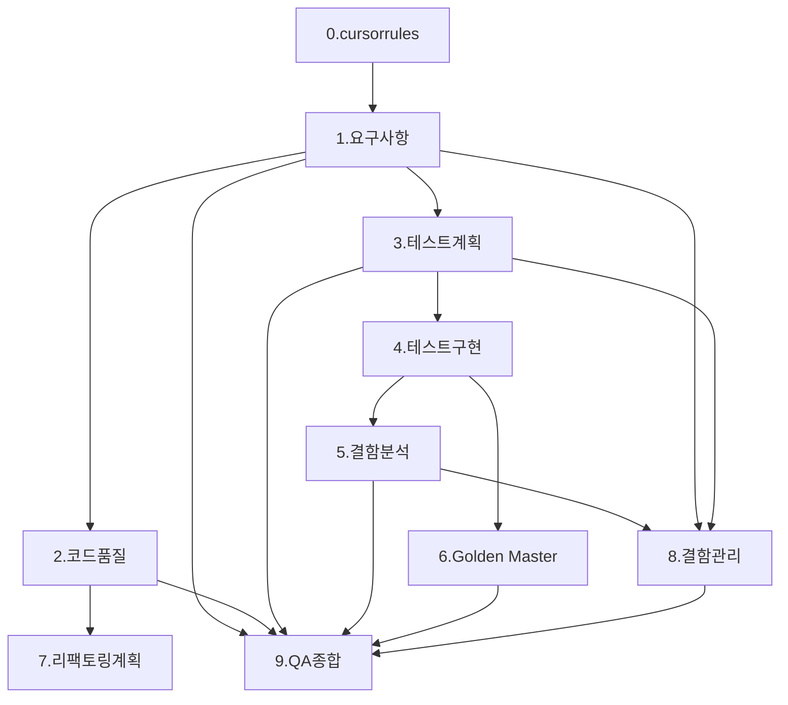

# TDD TV 프로젝트 — 최적화 프롬프트 (2026-05-19)

> 원본: `Prompt/full-transcript-2026-05-19_prompt.md` (세션 1~10)  
> 목적: 대화 이력·중복·모호 표현을 제거하고, **단계별 재실행 가능한 프롬프트**로 정리

---

## 사용 방법

1. **공통 컨텍스트**를 먼저 읽고, 해당 단계 프롬프트를 그대로 복사해 사용한다.
2. 단계는 **의존 순서**를 따른다 (이전 단계 산출물 `@` 참조).
3. 코드·구현 변경 단계는 반드시 `cmake --build build && ctest` Green을 완료 조건으로 둔다.
4. 세션 종료 시 **후처리 프롬프트**를 한 번 실행한다.

---

## 공통 컨텍스트 (모든 단계에 적용)

| 항목 | 내용 |
|------|------|
| 프로젝트 | TDD TV — C++17, CMake, Google Test, gcov/lcov |
| 절대 제약 | `Tuner.h` 수정 금지 · 채널 범위 `0`~`99` |
| 테스트 | Given-When-Then · `TEST_F` · 경계값 `0`, `99` 필수 |
| 리팩토링 | 테스트 Green 상태에서만 · 동작 변경 없음 · 매직 넘버 상수화 |
| 검증 명령 | `cmake --build build && ctest` |
| 산출물 언어 | 설명·문서는 **한글**, 코드·식별자는 기존 프로젝트 규칙 준수 |

**프롬프트 구조:** `[P]` 역할 · `[C]` 맥락 · `[T]` 작업 · `[F]` 산출물 형식

---

## 단계별 프롬프트

### 0. 프로젝트 규칙 (.cursorrules)

```
[P] 레거시 C++ QA/리팩토링 시니어 엔지니어
[C] TDD TV C++17 프로젝트 — Cursor AI가 항상 따를 프로젝트 규칙 정의
[T] 프로젝트 루트 `.cursorrules` 작성
    - 기술 스택: C++17, CMake, Google Test, gcov/lcov
    - 절대 규칙: Tuner.h 수정 금지, channel 0~99
    - 테스트: Given-When-Then, TEST_F, 경계값(0/99), 관찰 가능한 동작 검증
    - 리팩토링: Green에서만, 매직 넘버 상수화, 최소 변경
    - 작업 절차: Red → Green → Refactor
[F] `.cursorrules`에 붙여넣기 가능한 완성 텍스트 (한글 설명)
```

**완료 기준:** `.cursorrules` 파일 생성

---

### 1. 요구사항 분석

```
@README.md

[P] 시니어 C++ QA 엔지니어
[C] TDD TV C++17 (CMake, Google Test) — README 기반 도메인 요구사항
[T] C++ 구현·테스트 관점으로 요구사항 재정리
    1) 기본 원칙 및 범위
    2) 숫자 버튼 입력·채널 이동 — 표
    3) 선호 채널(Favorites) — 표
    4) 채널 검색(스캔) — 표
    5) Up/Down 동작 — 표
    6) 예외·경계값 (0, 99, 잘못된 입력)
    7) Google Test 시나리오 번호 목록 (30건 이상 권장)
[F] Markdown(표+번호 목록) → docs/requirements_analysis.md 저장
```

**완료 기준:** `docs/requirements_analysis.md` 생성 (코드 변경 없음)

---

### 2. 코드 품질 분석

```
@include/TVController.h @include/remoteKey.h @src/TVController.cpp

[P] 시니어 C++ 아키텍트 + 모던 C++ 리뷰어
[C] TVController — SOLID·Code Smell 관점 정적 분석 (Tuner.h 미수정 전제)
[T] TVController 클래스 품질 분석
    - SRP/OCP/LSP/ISP/DIP 위반 여부
    - Magic Number, 긴 메서드, 분기 복잡도, 결합도
    - 리팩토링 우선순위 1~5 (근거 포함)
[F] Markdown 표 → docs/code_quality_report.md 저장
```

**완료 기준:** `docs/code_quality_report.md` 생성

---

### 3. 테스트 계획

```
@include/remoteKey.h @include/Tuner.h @include/TVController.h @docs/requirements_analysis.md

[P] 시니어 QA 리드
[C] 요구사항 분석 결과 기반 단위·회귀 테스트 전략
[T] 테스트 계획서 작성
    - TEST_F 단위 테스트 범위·우선순위 (P0/P1/P2)
    - 경계값 매트릭스 (channel 0, 99)
    - 예외·특이 케이스 목록
    - 커버리지 목표(90%+) 및 gcov/lcov 측정·개선 절차
[F] docs/test_plan.md 저장
```

**완료 기준:** `docs/test_plan.md` 생성

---

### 4. 테스트 구현 (TDD)

```
@include/remoteKey.h @include/Tuner.h @include/TVController.h
@test/TVControllerTest.cpp @test/TunerTest.cpp
@docs/requirements_analysis.md @docs/test_plan.md

[P] 테스트 설계에 강한 시니어 C++ QA
[C] C++17, Google Test — FakeTuner/Mock 패턴 (Tuner.h 수정 불가)
[T] 기능별 최소 5개 TEST_F 작성 후 Green 달성
    - 영역: 숫자 입력 / 채널 이동 / 선호 채널 / 채널 검색 / Up·Down
    - 검증: EXPECT_EQ/ASSERT_EQ + Tuner::getCurrentCH()
    - Given-When-Then 주석, 경계값 0·99, 잘못된 입력
    - 테스트 통과에 필요한 최소 구현만 TVController·remoteKey에 추가
[F] 완성 테스트 코드 + 구현 diff. cmake --build build && ctest Green
```

**완료 기준:** `ctest` 전체 Green (TVControllerTest + TunerTest)

---

### 5. 결함 분석·문서화

```
@include/remoteKey.h @include/TVController.h @src/TVController.cpp
@test/TVControllerTest.cpp @include/Tuner.h
@docs/requirements_analysis.md

[P] C++ QA 엔지니어 (디버깅·결함 분석)
[C] 레거시 대비 동작 차이 — Tuner.h 수정 불가
[T]
    A) ctest 실패·요구사항 불일치 분석
       - EXPECT_EQ 차이, 버그 위치, 심각도, 최소 수정안
    B) 결함 목록 문서화
       - ID, Severity, ItemType, Steps, Expected, Actual, Root Cause, Fix Summary
[F]
    A) 수정 diff + ctest Green 확인
    B) docs/defect_list.md (DEF-001~ 형식)
```

**완료 기준:** `docs/defect_list.md` + `ctest` Green

---

### 6. Golden Master 회귀 테스트

```
@test/support/TexttestFixture.cpp @include/remoteKey.h
@src/TVController.cpp @include/Tuner.h @test/TVControllerTest.cpp

[P] Approval/Golden Master 회귀 테스트 설계 전문가
[C] C++17, Google Test, CMake — TexttestFixture 출력 캡처
[T] Golden Master 체계 구현
    1) expected 출력(.approved.txt) 생성·보관 전략 (test/golden/)
    2) Google Test 파일 비교 테스트 (TVControllerGoldenTest)
    3) CMake/ctest 통합 + update-golden 타깃
    4) CI(.github/workflows) 자동 실행
[F] 테스트 코드 + CMake 수정 + 실행·갱신 방법 문서(주석 또는 README 섹션)
```

**완료 기준:** Golden 테스트 포함 `ctest` Green

---

### 7. 리팩토링 계획

```
@docs/code_quality_report.md @docs/requirements_analysis.md
@include/Tuner.h @include/TVController.h @include/remoteKey.h @src/TVController.cpp

[P] 모던 C++ 리팩토링 코치
[C] Tuner.h 수정 금지, channel 0~99, 현재 ctest Green 기준선
[T] TVController 단계별 리팩토링 로드맵
    - 조건 분기 축소, 전략/테이블, 예외 정리, 결합도·SRP
    - 매직 넘버 상수화, ChannelInputBuffer·KeyHandler 등 도메인 분리 제안
    - Phase별: 목표 / 변경 파일 / 리스크 / 롤백 / 검증 명령
[F] 단계별 체크리스트 Markdown (docs/refactoring_plan.md 권장)
    각 Phase 완료 시: cmake --build build && ctest
```

**완료 기준:** 실행 가능한 Phase 0~N 로드맵 문서 (당장 코드 변경은 선택)

---

### 8. 결함 관리 프로세스 (QA)

```
@docs/defect_list.md @docs/requirements_analysis.md @docs/test_plan.md

[P] QA 리드 엔지니어
[C] defect_list(인벤토리)와 분리된 **프로세스·템플릿** 문서
[T] 결함 관리 체계 문서 작성
    1) Severity × ItemType(5종) 분류 매트릭스
    2) 결함 보고서 템플릿 (재현/기대/실제/원인/수정/검증)
    3) 품질 메트릭 수집 계획 (통과율, gcov/lcov 커버리지, 단계별 발견율)
    4) (선택) GitHub Issues 연동 워크플로
[F] docs/defect_report.md 저장
```

**완료 기준:** `docs/defect_report.md` 생성

---

### 9. QA 종합 검토 (최종)

```
@docs/requirements_analysis.md @docs/code_quality_report.md
@docs/test_plan.md @docs/defect_report.md @docs/defect_list.md
@include/remoteKey.h @include/Tuner.h @include/TVController.h @src/TVController.cpp
@test/TVControllerTest.cpp @test/TVControllerGoldenTest.cpp

[P] QA 리드 엔지니어
[C] 1~8단계 산출물 + 실제 ctest·gcov 결과
[T] QA 활동 종합 보고
    1) 테스트 완료율·커버리지 (목표 대비 gcov 수치, 측정 명령 명시)
    2) 결함 패턴 (ItemType·Severity 분포)
    3) 9단계 중 효과적 단계 / 개선 필요 단계
    4) 다음 레거시 프로젝트 Best Practice 5가지
    5) Cursor AI 활용 효과 (정량·정성)
[F] docs/qa_final_report.md 저장
    작성 전 build-coverage로 ctest·커버리지 재검증 후 수치 반영
```

**완료 기준:** `docs/qa_final_report.md` + 최신 ctest/커버리지 수치 반영

---

## 후처리 프롬프트 (각 단계 완료 후 1회)

```
[P] 프로젝트 문서·배포 담당
[C] 방금 완료한 단계 번호 N, 산출물 경로
[T] 아래 순서로 실행
    1) Report/N.<단계-slug>-report-YYYY-MM-DD.md 생성
       - 수행 작업, 변경 파일, 검증 결과(ctest/커버리지), 다음 단계 권고
    2) Prompt/N.<단계-slug>-transcript-YYYY-MM-DD_prompt.md Export
       - User 프롬프트 + Assistant 요약만 (대화형 형식)
    3) Prompt/full-transcript-YYYY-MM-DD_prompt.md 갱신 (세션 N 반영)
    4) Windows cmd.exe로 git add → commit → push 
[F] 생성·갱신된 파일 경로 목록 + git push 결과
```

**슬러그 예:** `requirements-analysis`, `test-implementation`, `golden-master`, `qa-final-report`

---

## 단계 의존 관계



---

## 원본 대비 최적화 요약

| 개선 항목 | 내용 |
|-----------|------|
| 중복 제거 | 기술 스택·Tuner.h·채널 범위·테스트 규칙을 **공통 컨텍스트**로 1회만 명시 |
| 노이즈 제거 | Assistant 응답, "작성", "Briefly inform..." 등 대화 잔여물 삭제 |
| 의존성 명시 | `@` 참조 파일·선행 docs를 단계별로 고정 |
| 완료 기준 | 각 단계에 검증 가능한 **Done** 조건 추가 |
| 오류 수정 | 세션 8의 `@GildedRose.*` 참조 제거 (본 저장소 미포함) |
| 후처리 통합 | Report/Transcript/Git push를 **단일 후처리 프롬프트**로 통합 |
| 재사용성 | 세션 번호·파일명 규칙·mermaid 의존 그래프로 온보딩 시간 단축 |

---

## 빠른 복사: 전체 워크플로우 (한 번에 지시할 때)

```
TDD TV C++17 레거시 QA 프로젝트를 아래 순서로 진행해줘.
공통 제약: Tuner.h 수정 금지, channel 0~99, Given-When-Then TEST_F, Green에서만 리팩토링.

0) .cursorrules 작성
1) @README.md → docs/requirements_analysis.md
2) TVController 품질 → docs/code_quality_report.md
3) 테스트 계획 → docs/test_plan.md
4) TEST_F 구현 + Green (docs/requirements_analysis.md, test_plan.md 참조)
5) 결함 분석·docs/defect_list.md + 수정 후 Green
6) Golden Master (TexttestFixture, test/golden/, CI)
7) 리팩토링 로드맵 (code_quality_report 기준)
8) docs/defect_report.md (프로세스·템플릿)
9) docs/qa_final_report.md (gcov 재측정 후 작성)

각 단계 완료 시: Report + Prompt transcript Export + full-transcript 갱신 + git push.
모든 설명은 한글, 검증은 cmake --build build && ctest.
```
